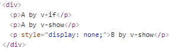
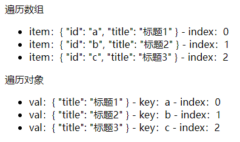
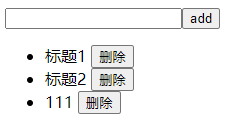
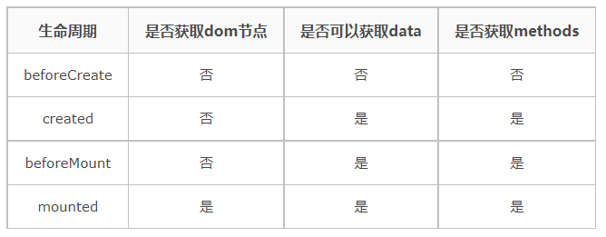
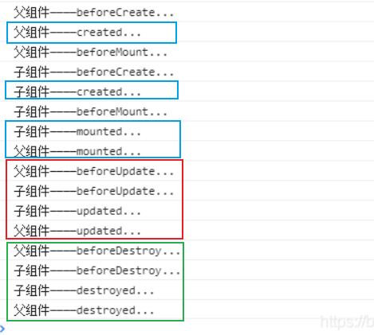
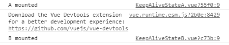
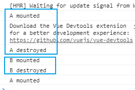
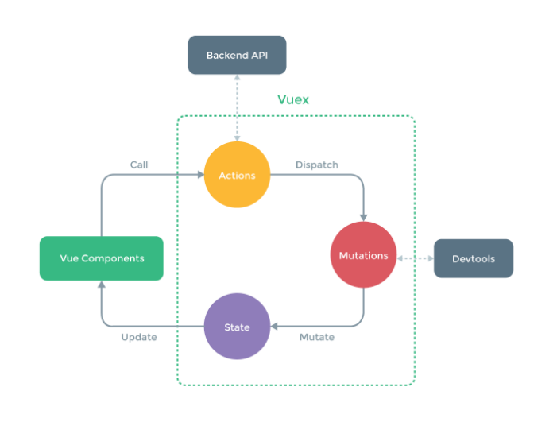
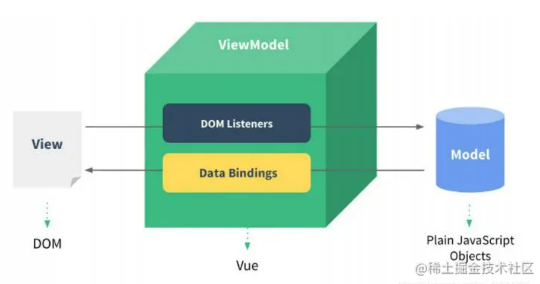

---
navbar:false
sidebar:auto
---

## vue 基本使用
### v-html
会有 XSS 风险，会覆盖子组件。

[XSS攻击原理](https://blog.csdn.net/t131452n/article/details/80980193)

### computed & watch
computed 有缓存，data 不变则不会重新计算。

watch 监听引用类型，拿不到 oldVal。

[vue2 响应式原理的一些缺陷](https://cn.vuejs.org/v2/guide/reactivity#%E5%AF%B9%E4%BA%8E%E5%AF%B9%E8%B1%A1)，vue3 使用了 ES6 的新特性 proxy 来实现响应式。查看 vue3 响应式原理。

#### computed
```JavaScript
<template>
    <div>
        <p>num {{num}}</p>
        <p>double1 {{double1}}</p>
        // v-model 双向数据绑定，一定要有 get 和 set 两个。如果只有一个的话，会报错
        <input v-model="double2"/>
    </div>
</template>

<script>
export default {
    data() {
        return {
            num: 20
        }
    },
    computed: {
        double1() {
            return this.num * 2
        },
        double2: {
            get() {
                return this.num * 2
            },
            set(val) {
                this.num = val/2
            }
        }
    }
}
</script>
```

#### watch
```JavaScript
<template>
    <div>
        <input v-model="name"/>
        <input v-model="info.city"/>
    </div>
</template>

<script>
export default {
    data() {
        return {
            name: 'cbw',
            info: {
                city: '长沙'
            }
        }
    },
    watch: {
        name(oldVal, val) {
            // eslint-disable-next-line
            console.log('watch name', oldVal, val) // 值类型，可正常拿到 oldVal 和 val
        },
        info: {
            handler(oldVal, val) {
                // eslint-disable-next-line
                console.log('watch info', oldVal, val) // 引用类型，拿不到 oldVal 。因为指针相同，此时已经指向了新的 val
                // 所以 oldVal 和 val 的值其实已经一样了
            },
            deep: true // 深度监听
        }
    }
}
</script>
```

### class & style
1) 使用动态属性
2) 使用驼峰式写法。在写 style 的时候，要使用驼峰式写法。

```JavaScript
<template>
    <div>
        // black，yellow 都是 class 的具体名称，style 标签里有定义
        <p :class="{ black: isBlack, yellow: isYellow }">使用 class</p>

        // blackStyle，yellowStyle 都是变量，在 data() 里有定义
        <p :class="[blackStyle, yellowStyle]">使用 class （数组）</p>

        <p :style="styleData">使用 style</p>
    </div>
</template>

<script>
export default {
    data() {
        return {
            isBlack: true,
            isYellow: true,

            blackStyle: 'black',
            yellowStyle: 'yellow',

            styleData: {
                fontSize: '40px', // 转换为驼峰式
                color: 'red',
                backgroundColor: '#ccc' // 转换为驼峰式
            }
        }
    }
}
</script>

<style scoped>
    .black {
        background-color: #999;
    }
    .yellow {
        color: yellow;
    }
</style>
```

### v-if 和 v-show 的区别及使用场景

如果不是很频繁的切换，就用 v-if，因为 dom 节点的销毁和加载，会消耗一些性能。<br>
如果是很频繁的切换，就用 v-show。



```JavaScript
<template>
    <div>
        <p v-if="type === 'a'">A by v-if</p>
        <p v-else-if="type === 'b'">B by v-if</p>
        <p v-else>other by v-if</p>

        <p v-show="type === 'a'">A by v-show</p>
        <p v-show="type === 'b'">B by v-show</p>
    </div>
</template>

<script>
export default {
    data() {
        return {
            type: 'a'
        }
    }
}
</script>
```

### 循环（列表）的渲染



```JavaScript
<template>
    <div>
        <p>遍历数组</p>
        <ul>
            <li v-for="(item, index) in listArr" :key="item.id">
                item：{{item}} - index：{{index}}
            </li>
        </ul>

        <p>遍历对象</p>
        <ul >
            <li v-for="(val, key, index) in listObj" :key="key">
                val：{{val}} - key：{{key}} -  index：{{index}}
            </li>
        </ul>
    </div>
</template>

<script>
export default {
    data() {
        return {
            flag: false,
            listArr: [
                { id: 'a', title: '标题1' }, // 数据结构中，最好有 id ，方便使用 key
                { id: 'b', title: '标题2' },
                { id: 'c', title: '标题3' }
            ],
            listObj: {
                a: { title: '标题1' },
                b: { title: '标题2' },
                c: { title: '标题3' },
            }
        }
    }
}
</script>
```

#### v-for 和 v-if 不能在同一个标签上一起使用
因为 v-for 的计算优先级高于 v-if。

## 事件
event 参数，自定义参数：<br>
1）如果不需要传一个自定义的参数过去，event 可以直接在定义的函数里获取 <br>
```JavaScript
<button @click="increment1">+1</button>

methods: {
    // 直接在定义的函数里获取 event
    increment1(event) {
        
    }
},
```

2）如果需要传一个自定义的参数过去（这里是 2），就需要将 event 参数传递过去。如 increment2(2, $event)
```JavaScript
<button @click="increment2(2, 'abc', $event)">+2</button>

methods: {
    increment2(val, str, event) { // 传递过来好几个除 event 的参数都可以

    }
},
```

完整示例：

【重点】要和 react 的进行区分：<br>
1. event 是原生的（MouseEvent）<br>
2. 事件被挂载到当前元素<br>
和 DOM 事件一样

```JavaScript
<template>
    <div>
        <p>{{num}}</p>

        // 如果不需要传一个自定义的参数过去，event 可以直接在定义的函数里获取
        <button @click="increment1">+1</button>

        // 如果需要传一个自定义的参数过去（这里是 2），就需要将 event 参数传递过去
        <button @click="increment2(2, $event)">+2</button>
    </div>
</template>

<script>
export default {
    data() {
        return {
            num: 0
        }
    },
    methods: {
        increment1(event) {
            // eslint-disable-next-line
            console.log('event', event, event.__proto__.constructor) // 是原生的 event 对象
            // eslint-disable-next-line
            console.log(event.target)
            // eslint-disable-next-line
            console.log(event.currentTarget) // 注意，事件是被注册到当前元素的，和 React 不一样
            this.num++

            // 1. event 是原生的
            // 2. 事件被挂载到当前元素
            // 和 DOM 事件一样
        },
        increment2(val, event) {
            // eslint-disable-next-line
            console.log(event.target)
            this.num = this.num + val
        },
        loadHandler() {
            // do some thing
        }
    },
    mounted() {
        window.addEventListener('load', this.loadHandler)
    },
    beforeDestroy() {
        //【注意】用 vue 绑定的事件，组建销毁时会自动被解绑
        // 自己绑定的事件，需要自己销毁！！！
        window.removeEventListener('load', this.loadHandler)
    }
}
</script>
```
### 事件修饰符
.stop：防止事件冒泡，等同于 JavaScript 中的 event.stopPropagation()<br>
.prevent：防止执行预设的行为，等同于 JavaScript 中的 event.preventDefault()<br>
.capture：捕获冒泡<br>
.self：将事件绑定到自身，只有自身才能触发<br>
.ctrl: 即使 Alt 或 Shift 被同时按下也会触发<br>
.ctrl.exact: 有且只有 Ctrl 被按下的时候才会触发<br>
.exact: 没有任何系统修饰符被按下的时候触发<br>
.once：只触发一次<br>
.passive：不阻止事件的默认行为

[vue中的事件修饰符使用方式](https://www.jianshu.com/p/ff19cb0cccfd)

【1】阻止事件向父元素传递，阻止任何父事件处理程序被执行，等同于JavaScript中的event.stopPropagation()。

```JavaScript
<a v-on:click.stop="todoThis"></a>
```

【2】阻止某些标签拥有的自身的默认事件的发生

```JavaScript
// 提交事件不再重新加载页面
<form v-on:submit.prevent="onSubmit"></form>

// <a>标签点击后会进行页面的跳转
<a href="http://www.baidu.com" @click.prevent>点击跳转</a>
```

【3】修饰符可以串联

```JavaScript
<a v-on:click.stop.prevent="doThat"></a>
```

【4】冒泡发生时，有.capture修饰符的dom元素会优先执行<br>

```JavaScript
<div v-on:click.capture="doThis"></div>
```

【5】将事件绑定到自身，只有自身才能触发，通常用于避免冒泡事件的影响。<br>

```JavaScript
<div v-on:click.self="doThat"></div>
```

### 按键修饰符
1）.trim<br>
2) .lazy<br>
3) .number

### 表单使用

【1】输入框
```JavaScript
<p>输入框: {{name}}</p>

<input type="text" v-model.trim="name"/>
<input type="text" v-model.lazy="name"/>
<input type="text" v-model.number="age"/>
```

【2】多行文本

```JavaScript
<p>{{desc}}</p>

<textarea v-model="desc"></textarea>
// 注意，<textarea>{{desc}}</textarea> 是不允许的！！！
```

【3】复选框

```JavaScript
<p>{{checked}}</p>

// type="checkbox"
<input type="checkbox" v-model="checked"/>
```

【4】多个复选框

```JavaScript
<p>{{checkedNames}}</p>

// type="checkbox" id for
<input type="checkbox" id="jack" value="Jack" v-model="checkedNames">
<label for="jack">Jack</label>

<input type="checkbox" id="john" value="John" v-model="checkedNames">
<label for="john">John</label>
```

【5】单选

```JavaScript
<p>{{gender}}</p>

// type="radio" id for
<input type="radio" id="male" value="male" v-model="gender"/>
<label for="male">男</label>

<input type="radio" id="female" value="female" v-model="gender"/>
<label for="female">女</label>
```

【6】下拉列表选择

```JavaScript
<p>{{selected}}</p>

<select v-model="selected">
    <option disabled value="">请选择</option>
    <option>A</option>
    <option>B</option>
</select>
```

【7】下拉列表选择（多选）

```JavaScript
<p>{{selectedList}}</p>

// multiple
<select v-model="selectedList" multiple>
    <option disabled value="">请选择</option>
    <option>A</option>
    <option>B</option>
</select>
```

## vue 组件使用
### props & $emit 父子组件通讯



index.vue：列表数据放在这里。

```JavaScript
<template>
    <div>
        <Input @add="addHandler"/>
        <List :list="list" @delete="deleteHandler"/>
    </div>
</template>

<script>
import Input from './Input'
import List from './List'

export default {
    components: {
        Input,
        List
    },
    data() {
        return {
            list: [
                {
                    id: 'id-1',
                    title: '标题1'
                },
                {
                    id: 'id-2',
                    title: '标题2'
                }
            ]
        }
    },
    methods: {
        addHandler(title) {
            this.list.push({
                id: `id-${Date.now()}`,
                title
            })
        },
        deleteHandler(id) {
            this.list = this.list.filter(item => item.id !== id)
        }
    }
}
</script>
```

Input.vue

```JavaScript
<template>
    <div>
        <input type="text" v-model="title"/>
        <button @click="addTitle">add</button>
    </div>
</template>

<script>
import event from './event'

export default {
    data() {
        return {
            title: ''
        }
    },
    methods: {
        addTitle() {
            // 调用父组件的事件
            this.$emit('add', this.title)

            // 调用自定义事件
            event.$emit('onAddTitle', this.title)

            this.title = ''
        }
    }
}
</script>
```

List.vue

```JavaScript
<template>
    <div>
        <ul>
            <li v-for="item in list" :key="item.id">
                {{item.title}}

                <button @click="deleteItem(item.id)">删除</button>
            </li>
        </ul>
    </div>
</template>

<script>
import event from './event'

export default {
    // props: ['list']
    props: {
        // prop 类型和默认值
        list: {
            type: Array,
            default() {
                return []
            }
        }
    },
    data() {
        return {

        }
    },
    methods: {
        deleteItem(id) {
            this.$emit('delete', id)
        },
        addTitleHandler(title) {
            // eslint-disable-next-line
            console.log('on add title', title)
        }
    },
    created() {
        // eslint-disable-next-line
        console.log('list created')
    },
    mounted() {
        // eslint-disable-next-line
        console.log('list mounted')

        // 绑定自定义事件
        event.$on('onAddTitle', this.addTitleHandler)
    },
    beforeUpdate() {
        // eslint-disable-next-line
        console.log('list before update')
    },
    updated() {
        // eslint-disable-next-line
        console.log('list updated')
    },
    beforeDestroy() {
        // 及时销毁，否则可能造成内存泄露
        event.$off('onAddTitle', this.addTitleHandler)
    }
}
</script>
```

### 自定义事件（适用所有不是父子组件的通讯）
可以与 vue3 中的使用 emit 插件 进行对比。

1）子组件 A （List.vue）中定义自定义事件并绑定。接收从 子组件 B 中传递过来的值。

```JavaScript
// 引入 event
import event from './event'

methods: {
    // 接收从 子组件 B 中传递过来的值
    addTitleHandler(title) {
        // eslint-disable-next-line
        console.log('on add title', title)
    }
},
mounted() {
    // 绑定自定义事件
    // 这个 event 是一个 vue 的实例
    event.$on('onAddTitle', this.addTitleHandler)
},
beforeDestroy() { // 在 vue3 中是在 unMounted 里
    // 及时销毁，否则可能造成内存泄露
    event.$off('onAddTitle', this.addTitleHandler)
}
```

自定义事件 event.js。vue 本身就具有自定义事件的能力。

```JavaScript
import Vue from 'vue'

export default new Vue()
```

2）子组件 B （Input.vue）中

```JavaScript
import event from './event'

methods: {
    addTitle() {
        // 调用自定义事件
        event.$emit('onAddTitle', this.title)
    }
}
```

### Vue 组件生命周期
1）挂载阶段<br>
2）更新阶段<br>
3）销毁阶段

在销毁阶段的 beforeDestroy 可以做啥，销毁自定义事件。
```JavaScript
beforeDestroy() { 
    event.$off('onAddTitle', this.addTitleHandler)
}
```


[官网图示](https://cn.vuejs.org/v2/guide/instance.html#%E7%94%9F%E5%91%BD%E5%91%A8%E6%9C%9F%E5%9B%BE%E7%A4%BA)

### created 和 mounted 区别
created 是将 vue 的实例给初始化了，vue 实例只是存在于 js 内存中的一个变量，还没有开始渲染。<br>
mounted 是组件在网页上真正的绘制完成了。

created：在模板渲染成html前调用，即通常初始化某些属性值，然后再渲染成视图。 <br>mounted：在模板渲染成html后调用，通常是初始化页面完成后，再对html的dom节点进行一些需要的操作。




### 生命周期（父子组件）



### vue 高级特性


### 描述组件渲染和更新的过程

### 双向数据绑定 v-model 的实现原理
可以与 vue3 的 modelValue 进行类比记忆。 props: modelvalue

#### vue3
[vue3 改造 v-model](https://v3.cn.vuejs.org/guide/migration/v-model.html#v-model-%E5%8F%82%E6%95%B0)

父组件里引用子组件的标签上使用 v-model，并且同步更新。总共有以下两步：

1.在自定义组件里创建一个 modelValue 的 props
```JavaScript
props: {
    modelValue: String
}
```

2.在更新值的时候，发送一个事件 'update:modelValue'
```JavaScript
context.emit('update:modelValue', targetValue)
```

<br>具体代码</br>

父组件

```JavaScript
<template>
  // v-model 相当于 :value 和 @input
  <Son v-model="sonValue"></Son>
  {{sonValue}}
</template>

<script lang="ts">
// 拿到子组件 Son 的文本框的值
import { defineComponent, ref } from 'vue'
import Son from '@/components/Son.vue'

export default defineComponent({
  name: 'FatherVue',
  components: {
    Son
  },
  setup () {
    const sonValue = ref('viking') // 因为是要响应式的，因此需要时 ref 类型
    return {
      sonValue
    }
  }
})
</script>

```

子组件

```JavaScript
<template>
  // :value @input 
  <input type="text" :value="inputVal.val" @input="sendValue">
</template>

<script lang="ts">
// 拿到子组件 Son 的文本框的值
import { defineComponent, PropType, reactive } from 'vue'

export default defineComponent({
  name: 'Son1Vue',
  props: {
    modelValue: String // 父组件的 v-model 传值
  },
  setup (props, context) {
    const inputVal = reactive({
      val: props.modelValue || ''
    })
    const sendValue = (e: KeyboardEvent) => { // 键盘输入事件
      const targetValue = (e.target as HTMLInputElement).value
      inputVal.val = targetValue
      context.emit('update:modelValue', targetValue) // 传出事件
    }
    return {
      inputVal,
      sendValue
    }
  }
})
</script>

```

#### vue2
例如: vue 颜色选择器。

父组件

```JavaScript
<template>
    <div>
        // 自定义 v-model
        <p>{{name}}</p>
        <CustomVModel v-model="#fff"/>

    </div>
</template>

<script>
import CustomVModel from './CustomVModel'

export default {
    components: {
        CustomVModel
    },
    data() {
        return {
            // 定义 v-model 的值
            name: 'cbw'
        }
    }
}
</script>
```

子组件

```JavaScript
<template>
    <!-- 例如：vue 颜色选择 -->
    <input type="text"
        :value="text1"
        @input="$emit('change1', $event.target.value)"
    >
    <!--
        1. 上面的 input 使用了 :value 而不是 v-model
        2. 上面的 change1 和 model.event1 要对应起来
        3. text1 属性对应起来
    -->
</template>

<script>
import event from '../Cart/event'
export default {
    model: {
        prop: 'text1', // 对应 props 里的 text1 这个属性
        event: 'change1'
    },
    props: {
        text1: String,
        default() {
            return ''
        }
    }

}
</script>
```

### $nextTick
Vue 是一个异步渲染的框架。异步：不需要等上一个操作执行完成，就可以进行下一个操作。data 改变之后，DOM 不会立刻渲染。$nextTick 会在 DOM 渲染之后被触发，以获取最新 DOM 节点。

```JavaScript
<template>
  <div id="app">
    <ul ref="ul1">
        <li v-for="(item, index) in list" :key="index">
            {{item}}
        </li>
    </ul>
    <button @click="addItem">添加一项</button>
  </div>
</template>

<script>
export default {
  name: 'app',
  data() {
      return {
        list: ['a', 'b', 'c']
      }
  },
  methods: {
    addItem() {
        this.list.push(`${Date.now()}`)
        this.list.push(`${Date.now()}`)
        this.list.push(`${Date.now()}`)

        // 1. 异步渲染，$nextTick 待 DOM 渲染完再回调
        // 3. 页面渲染时会将 data 的修改做整合，多次 data 修改只会渲染一次
        this.$nextTick(() => {
          // 获取 DOM 元素
          const ulElem = this.$refs.ul1
          // eslint-disable-next-line
          console.log( ulElem.childNodes.length )
        })
    }
  }
}
</script>

```

### slot
#### 作用域插槽

子组件

```JavaScript
<template>
    <a :href="url">
       // 1. 随便定义一个变量 slotData，用于在父组件中使用时定位到该 slot 作用域
        <slot :slotData="website">
            {{website.subTitle}} <!-- 默认值显示 subTitle ，即父组件不传内容时 -->
        </slot>
    </a>
</template>

<script>
export default {
    props: ['url'],
    data() {
        return {
            website: {
                url: 'http://wangEditor.com/',
                title: 'wangEditor',
                subTitle: '轻量级富文本编辑器'
            }
        }
    }
}
</script>
```

父组件

```JavaScript
<template>
    <div>
        <ScopedSlotDemo :url="website.url">

            // 2. 设置 v-slot 等于一个自定义变量。只是用于在下一步引用时使用
            <template v-slot="slotProps">
                // 3. 在这里引用 ScopedSlotDemo子组件 里的作用域
                {{slotProps.slotData.title}}
            </template>

        </ScopedSlotDemo>
    </div>
</template>

<script>
import SlotDemo from './SlotDemo'

export default {
    components: {
        SlotDemo
    }
}
</script>
```

#### 具名插槽
子组件：

```JavaScript
<template>
  <form class="validate-form-container">
    // 1.匿名插槽   
    <slot name="default"></slot>
    <div class="submit-area" @click.prevent="submitForm">
    // 2.具名插槽 
      <slot name="submit">
        // 这个是默认的内容，什么都不添加的时候会显示这个默认的内容
        <button type="submit" class="btn btn-primary">提交</button>
      </slot>
    </div>
  </form>
</template>
```

父组件：

```JavaScript
// 3. v-slot:submit，简写是 #submit，这个是配合具名插槽使用
<template v-slot:submit>
  <span class='btn'>submit</span>
</template>
```

### 动态组件
```JavaScript
:is = "component-name"
// 需要根据数据，动态渲染的场景。即组件类型不确定。
```

```JavaScript
<template>
    <div>
        // 动态组件
        <component :is="NextTickName"/>
    </div>
</template>

<script>
import NextTick from './NextTick'

export default {
    components: {
        NextTick
    },
    data() {
        return {
            NextTickName: "NextTick", // 与 components 的名称一致
        }
    }
}
</script>
```

循环渲染动态组件

```JavaScript
<template>
  <div>
    // 动态组件
    // v-for 遍历对象 val, key, index
    <div v-for="(val, key) in NextTickNameList" :key="key">
        <component :is="val.name" />
    </div>
  </div>
</template>

<script>
import CustomVModel from './CustomVModel'
import NextTick from './NextTick'

export default {
    components: {
        CustomVModel,
        NextTick
    },
    data() {
        return {
            NextTickNameList: {
                1: { name: 'CustomVModel'}, // 与 components 的名称一致
                2: { name: 'NextTick'},
            }
        }
    }
}
</script>
```

### 异步组件

对于体积比较大的组件，如代码编辑器，echarts图表渲染等。如果这些在开发时直接同步打包进来，体积会非常大，而且加载得会非常慢。

```JavaScript
<template>
  <div>
    <!-- 异步组件 -->
    <FormDemo v-if="showFormDemo"/>
    <button @click="showFormDemo = true">show form demo</button>
  </div>
</template>

<script>
export default {
    components: {
        FormDemo: () => import('../BaseUse/FormDemo')
    },
    data() {
        return {
            showFormDemo: false
        }
    }
}
</script>

```

### keep-alive
缓存组件的情况：频繁切换，但是不需要重复渲染。比如 Tab页 或 鼠标滑到什么地方就显示一个A，鼠标滑到什么地方就显示一个B。

<b>【1】如果添加了 keep-alive 标签。则每个组件都只会在第一次切换的时候加载一次，然后储存起来。第二次切换的时候就不会再去重新渲染。</b>




<b>【2】如果没有添加 keep-alive 标签。就会在切换组件时，将之前加载到页面上的组件销毁，再加载新的组件。</b>



#### 和 v-show 的区别
v-show 是直接通过 display: none 来控制显示隐藏。keep-alive 是在 vue 层级，在框架层级进行的一个 js 对象的渲染。<br>
如果标签不多，组件比较简单，可以选择用 v-show 来控制。如果是复杂点的，比如说带有层级或带有tab的。

```JavaScript
<template>
    <div>
        <button @click="changeState('A')">A</button>
        <button @click="changeState('B')">B</button>

        // 外面包裹了一层 keep-alive 标签
        <keep-alive> <!-- tab 切换 -->
            <KeepAliveStageA v-if="state === 'A'"/> <!-- v-show -->
            <KeepAliveStageB v-if="state === 'B'"/>
        </keep-alive>
    </div>
</template>

<script>
import KeepAliveStageA from './KeepAliveStateA'
import KeepAliveStageB from './KeepAliveStateB'

export default {
    components: {
        KeepAliveStageA,
        KeepAliveStageB
    },
    data() {
        return {
            state: 'A'
        }
    },
    methods: {
        changeState(state) {
            this.state = state
        }
    }
}
</script>
```

孙组件

```JavaScript
<template>
    <p>state A</p>
</template>

<script>
export default {
    mounted() {
        // eslint-disable-next-line
        console.log('A mounted')
    },
    destroyed() {
        // eslint-disable-next-line
        console.log('A destroyed')
    }
}
</script>
```

父组件里引用

```JavaScript
<template>
  <div>
    <!-- keep-alive -->
    <KeepAlive/>
  </div>
</template>

<script>
import KeepAlive from './KeepAlive'

export default {
    components: {
        KeepAlive
    }
}
</script>
```

### mixin
多个组件有相同的逻辑，抽离出来。

mixin 并不是完美的解决方案，会有一些问题。Vue3 提出的 Composition API 旨在解决这些问题：<br>
1）代码来源不明确，不利于阅读<br>
2）多 mixin 可能会造成命名冲突 <br>
3）mixin 和组件可能出现多对多的关系，复杂度较高。

父组件引入自定义混合组件 mixin.js

```JavaScript
<template>
    <div>
        <p>{{name}} {{major}} {{city}}</p>

        // 该 showName 用的是 mixin.js 里定义的方法
        <button @click="showName">显示姓名</button>
    </div>
</template>

<script>
import myMixin from './mixin'

export default {
    mixins: [myMixin], // 可以添加多个，会自动合并起来
    data() {
        return {
            name: 'cbw',
            major: 'js',
            city: "长沙" 
            // 混合进来的，与当前页面定义的，如果存在冲突的话，是取当前页面定义的
        }
    },
    methods: {
    },
    mounted() {
        // eslint-disable-next-line
        console.log('component mounted', this.name)
    }
}
</script>
```

自定义的 mixin.js

```JavaScript
export default {
    data() {
        return {
            city: '北京'
        }
    },
    methods: {
        showName() {
            // eslint-disable-next-line
            console.log(this.name)
        }
    },
    mounted() {
        // eslint-disable-next-line
        console.log('mixin mounted', this.name)
    }
}

```

## vuex
actions 里面才能做异步操作。如访问 后端 API。

| vuex属性 |  获取/更改值  |
| :-- | :--:  |
| getters: { <br> biggerColumnsLen(state) { <br> return state.columns.filter(c => c.id > 2).length <br> } <br> } |      store.getters.biggerColumnsLen    |
| actions: { <br>  fetchColumns (context) { <br> axios.get('/columns').then(res => { <br> context.commit('fetchColumns', res.data) <br> }) <br> } <br> }|  store.dispatch('fetchColumns') |
|mutation 里的必须是同步函数，因此可以使用 actions。 <br><br>  mutaitions: { <br> add (state) { <br> state.count++ <br>} <br> } |  store.commit('add) |
| state: { <br> count: 0 <br> }     |  store.state.count |



## vue-router
路由模式：hash，H5 history<br>
路由配置：动态路由，懒加载

### vue-router 路由模式
hash 模式（默认），如 http://abc.com/#/user/10 <br>
H5 history 模式，如 http://abc.com/user/20 <br>
后者需要 server 端支持，因此无特殊需求可选择前者。

```JavaScript
const router = new VueRouter({
    mode: 'history', // 使用 h5 history 模式
    routes: [...]
})
```

```JavaScript
const User = {
    // 获取参数如 10 20
    template: '<div>User {{ $router.params.id }}</div>'
}

const router = new VueRouter({
    routes:[
        {
            path: '/user/:id', // 动态路由
            component: () => import('./User.vue') 
        }
    ]
})
```

### 懒加载

和异步组件在 vue 文件里的加载方式一样 () => import

```JavaScript
component: () => import('./User.vue') 
```

## vue 原理
### 组件化 和 MVVM



M 对应 Model，V 对应 View，VM 对应 ViewModel。

Model 可以理解为 data 里定义的数据，如：
```JavaScript
data(){
    return {
        list: ['a', 'b', 'c']
    }
}
```

View 可以理解为在 template 里的标签，如：
```JavaScript
<li v-for="(item, index) in list" :key="index">
  {{item}}
</li>
```

ViewModel，就是 View 可以通过如 @click等事件 去修改 Model 里的数据。同时所有涉及到 Model 修改的这一层也是 ViewModel 这一层。

### Vue 响应式--Object.defineProperty
监听 data 变化的核心 API：Object.defineProperty

Object.defineProperty 存在一些缺陷，Vue3.0 使用 Proxy 进行了改写。但 Proxy 兼容性不好，且无法 polyfill。

#### Object.defineProperty 基本使用
```JavaScript
const data = {}
const name = '张三'
Object.defineProperty(data, "name", {
    get: function () {
        console.log('get')
        return name
    },
    set: function (newVal) {
        console.log('set')
        name = newVal
    }
})
```

```JavaScript
console.log(data.name) // get
data.name = '李四'     // set
```

#### 监听对象，监听数组
```JavaScript
npm i http-server -g
http-server -p 8001  // 随意设置一个端口号名称，这里设置的是 8001
```

HTML 文件

```JavaScript
<!DOCTYPE html>
<html>
<head>
    <meta charset="UTF-8">
    <meta name="viewport" content="width=device-width, initial-scale=1, minimum-scale=1,maximum-scale=1,user-scalable=no">
    <meta name="format-detection" content="telephone=no">
    <title>Observe demo</title>
</head>
<body>
    <p>响应式 demo</p>
    // 引入 observe.js 文件
    <script src="./observe.js"></script>
</body>
</html>
```

observe.js 文件

```JavaScript
// 触发更新视图
function updateView() {
    console.log('视图更新')
}

// 重新定义属性，监听起来
function defineReactive(target, key, value) {
    // 1. 深度监听
    observer(value)

    // 核心 API
    Object.defineProperty(target, key, {
        get() {
            return value
        },
        set(newValue) {
            if (newValue !== value) {
                // 2. 深度监听，如果赋值的新值是对象的话
                observer(newValue)

                value = newValue
                // 触发更新视图
                updateView()
            }
        }
    })
}

// 监听对象属性，observer 只是监听属性的入口。具体如何监听，是放在 defineReactive 函数里的
function observer(target) {
    if (typeof target !== 'object' || target === null) {
        // 不是对象或数组
        return target
    }

    // 重新定义各个属性（for in 可以遍历数组和对象）
    for (let key in target) {
        // 具体如何监听属性，是放 defineReactive 函数里的
        defineReactive(target, key, target[key]) 
    }
}

// 数据
const data = {
    name: 'zhangsan',
    age: 20,
    info: {
        address: '北京' // 需要深度监听
    },
}

// 监听数据，调用之前自定义的函数 observer
observer(data)

// 更改数据里的属性值
data.name = 'lisi'
data.age = 21 
// 3. 深度监听
data.info.address = '上海'

```

#### Object.defineProperty 缺陷
1）深度监听，需要递归到底，一次性计算量大<br>
2）新增属性或删除属性，监听不到，需要 Vue.set 或 Vue.delete 这两个 API 去完成<br>
3)  Object.defineProperty 这个 API 不具备监听数组的能力

### Vue 监听数组变化
```JavaScript
```

#### 复杂对象，深度监听

## react
### react 组件如何通讯

### JSX 本质是什么

### context 是什么，有何用途

### shouldComponentUpdate 的用途

### 工作中解决过的比较困难的问题，说一下自己项目中比较有亮点的地方

### 描述 redux 单向数据流
有一个流程图，可以将图画出来。

### setState 是同步还是异步（场景图）

## 框架综合应用
### 基于 React 设计一个 todolist（组件结构，redux state 数据结构）

### 基于 Vue 设计一个购物车（组件结构，vuex state 数据结构）

## webpack 面试题
### 前端代码为何要进行构建和打包

### module chunk bundle 分别什么意思，有何区别？

### loader 和 plugin 的区别

### webpack 如何实现懒加载

### webpack 常见性能优化

### babel-runtime 和 babel-polyfill 的区别

## 如何应对上述面试题
1）框架的使用（基本使用，高级特性，周边插件）<br>
2）框架的原理（基本原理的了解，热门技术的深度，全面性）<br>
3）框架的实际应用，即设计能力（组件结构，数据结构）

## 项目上遇到的难点以及如何解决的
？？？？？？？
考察的是解决分析问题的能力

一个比较投机取巧的例子：当时是做一个需求，要根据不同人员的权限去更改他所要走的流程结构。。。如果要梳理整个逻辑，需要花费很长的事件。直接就用一个 div 的盒子对其进行遮挡，也达到了相应的效果。

需要使用之前没用过的插件库

## 浏览器的事件循环
### 为什么 js 在浏览器中有事件循环的机制
因为 js 有一个特性，即它是单线程（什么是单线程？？？）的。
举个例子：如果有两个线程同时在操作 DOM，一个线程删除了当前的 DOM 节点，而另一个线程是要操作当前的 DOM 节点，这样的话则会出错。通过 event loop 实现一些非阻塞事件，从而使得代码不需要必须从上往下一步一步执行。

### 事件循环中两种任务
单一任务事件中，微任务先执行<br>
宏任务：整体代码、setTimeout、setInterval、node里的I/O操作<br>
微任务：new Promise().then 这个 .then() 里的回调是微任务、MutationObserver（监听元素变化）（前端的回溯里可能会用到？）<br>
同步异步 <br>

### 为什么要有微任务的概念，只有宏任务可以吗
单一任务事件中，微任务会先执行。宏任务保持先进先出的原则执行。。。。。。

### Node中的事件循环 和 浏览器中的事件循环 的区别
宏任务的执行顺序：<br>
1、timers 定时器：执行已经安排的 setTimeout 和 setInterval 的回调函数 <br>
2、pending callback 特定回调：执行延迟到下一个循环迭代的 I/O 回调 <br>
3、idle，prepare：仅系统内部使用 <br>
4、poll：检索新的 I/O 事件，执行与 I/O 相关的回调 <br>
5、check：执行 setImmediate() 回调函数 <br>
6、close callbacks：socket.on('close',()=>{})

### 微任务和宏任务在 node 的执行顺序
Node v10及以前：<br>
1、执行完一个阶段中的所有任务 <br>
2、执行 nextTick 队列里的内容 <br>
3、执行完微任务队列的内容 <br>

Node v10 以后：<br>
和浏览器的行为统一了

## 判断事件的输出顺序
考察事件循环的时候会问到
```JavaScript
        // 执行一次整体代码（是宏任务）后，微任务先执行，宏任务再执行
        // 宏队列保持先进先出原则，要完成一个宏任务后才会执行下一个宏任务
        async function async1() { // 微队列
            console.log('async1 start'); // 2

            // await 可以理解成 new Promise
            await async2(); 
            console.log('async1 end') // 6

            // 上面两行代码就相当于
            // new Promise(() => {
            //     async2()
            // }).then(() => {
                   // 将 await 后面的语句全部都放入 .then() 里 
            //     console.log('async1 end')
            // })
        }

        async function async2() {
            console.log('async2'); // 3
        }

        console.log('script start') // 1

        // setTimeout 是宏任务，整体代码也是宏任务
        // 当整体代码这个宏任务没有执行完成时，setTimeout 这个宏任务不会开始执行
        setTimeout(function () { // 宏任务优先级低于微任务
            console.log('setTimeout') // 7 这里是 8
        }, 0)

        async1()

        new Promise(function (resolve, reject) {
            console.log('promise1') // 4
            resolve()
        }).then(function () { // new Promise().then() 的 .then() 里是微任务，相比宏任务要先执行
            console.log('promise2') // 8 这里是 7
        })
        console.log('script end') // 5
```


```JavaScript
        console.log('start')
        setTimeout(() => {
            console.log('children2')
            Promise.resolve().then(() => {
                console.log('children3')
            })
        }, 0)

        new Promise(function (resolve, reject) {
            console.log('children4')
            // setTimeout 是宏队列的
            setTimeout(function () {
                console.log('children5')
                resolve('children6')
            }, 0)
        }).then((res) => {
            console.log('children7')
            setTimeout(() => {
                console.log(res)
            }, 0)
        })

        // 整体代码、setTimeout、setInterval 是宏队列的
        // Promise 的 .then() 是微队列的，比宏队列要先执行
        // 执行顺序
        // start
        // children4
        // 第一轮宏任务结束，尝试清空微任务队列，发现没有微任务
        // 为什么没有微任务：因为  resolve('children6') ，是放在 setTimeout 里面的，说明第一轮宏任务完成的时候，promise 的 .then() 并没有添加到微任务里
        // children2
        // 第二轮宏任务结束，尝试清空微任务队列
        // children3
        // children5
        // children7
        // children6
```

```JavaScript
        const p = function () {
            return new Promise((resolve, reject) => {
                const p1 = new Promise((resolve, reject) => {
                    setTimeout(() => {
                        resolve(1)
                    }, 0)
                    resolve(2)
                })
                p1.then((res) => {
                    console.log(res)
                })
                console.log(3)
                resolve(4)
            })
        }

        p().then((res) => {
            console.log(res)
        })

        console.log('end')

        // 不会执行 resolve(1)，因为执行的条件是 状态发生改变，这里已经执行了 resolve(2)，状态改变的结果已经输出。
        // 因此执行结果是： 3 end 2 4

        // 如果将 resolve(2) 去掉，则执行结果是：3 end 4 1
```

## 事件的捕获和冒泡机制
事件捕获(自顶向下)：从最顶层的 window 对象开始逐渐往下传播事件，即最顶层的 window 对象最早接收事件，最低层的具体被操作的元素最后接收事件。<br>

事件冒泡(自底向上)：与事件捕获相反，是自底向上冒的。<br>

### window.addEventListener 
window.addEventListener 监听的是什么阶段的事件:<br>

window.addEventListener 里面有三个参数,第三个参数可传可不传,当不传的时候,默认是 false,这样就是冒泡阶段,如果传的是 true,则是捕获阶段    

window.addEventListener('click',()=>{

},true/false) // 默认是 false (冒泡阶段),设置为 true (捕获阶段)

### 平常有哪些场景用到了这个机制
事件委托通俗地来讲，就是把一个元素响应事件（click、keydown......）的函数委托到另一个元素；<br>

一般来讲，会把一个或者一组元素的事件委托到它的父层或者更外层元素上，真正绑定事件的是外层元素，当事件响应到需要绑定的元素上时，会通过事件冒泡机制从而触发它的外层元素的绑定事件上，然后在外层元素上去执行函数。  

[array.prototype 属性](https://cloud.tencent.com/developer/section/1191536)