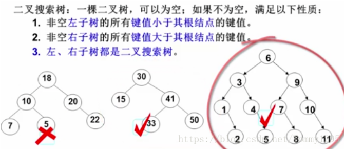

## 时间复杂度
冒泡排序，比较的次数是 (N-1)+(N-2)+(N-3)+……+1 = aN²+bN+c，时间复杂度其实算的就是当数值在无穷尽大时，它计算需要的时间，因此只选择最高优先级，并且忽略最高优先级的系数，因此它的时间复杂度就是 O(N)。

## 运算符
| 运算符 |     名称     |                           描述                           |
| :----: | :----------: | :------------------------------------------------------: |
|   &    |     AND      |             只有两位都是 1 得到的结果才是 1              |
|   I    |      OR      |             如果两位之一为 1 则设置每位为 1              |
|   ^    |     XOR      |           如果两位只有一位为 1 则设置每位为 1            |
|   ~    |     NOT      |                        反转所有位                        |
|   <<   | 零填充左位移 |       通过从右推入零向左位移，并使最左边的位脱落。       |
|   >>   | 有符号右位移 | 通过从左推入最左位的拷贝来向右位移，并使最右边的位脱落。 |
|  >>>   | 零填充右位移 |      通过从左推入零来向右位移，并使最右边的位脱落。      |


|  操作   | 结果  |   等同于    | 结果  |
| :-----: | :---: | :---------: | :---: |
|  5 & 1  |   1   | 0101 & 0001 | 0001  |
|  5 I 1  |   5   | 0101 I 0001 | 0101  |
|  5 ^ 1  |   4   | 0101 ^ 0001 | 0100  |
|   ~ 5   |  10   |    ~0101    | 1010  |
| 5 << 1  |  10   |  0101 << 1  | 1010  |
| 5 >> 1  |   2   |  0101 >> 1  | 0010  |
| 5 >>> 1 |   2   | 0101 >>> 1  | 0010  |

### 异或运算
N^0=N，N^N=0<br>
做异或运算的前提是，两个数指向的是不同的地址空间，否则该地址的值就会被抹成0。<br>

【例如】：交换a和b的数值

```javascript
  let a=10
  let b=90
  a=a^b
  b=a^b
  a=a^b
  console.log('aaaaaaa',a)

  // a=甲^乙
  // b=甲^乙^乙=甲
  // a=甲^乙^甲=乙
```

<b>一个数组中，有1个数出现了奇数次，其它数都出现了偶数次，怎么找出出现奇数次的这1个数。</b><br>

一个数组中，有2个数出现了奇数次，其它数都出现了偶数次，怎么找出出现奇数次的这2个数。<br>

要求：时间复杂度 O(N)，额外时间复杂度 O(1)</b>

```javascript
    // 认识复杂度和简单排序算法（1小时08分处）
    // 有1个数出现奇数次
    let array = [1, 2, 2, 3, 3]
    let b = 0
    for (let i = 0; i <= array.length; i++) {
        b = b ^ array[i]
    }
    console.log('bbbbbbbbb', b)

    // 有2个数出现奇数次
    // 数组里的数全都是二进制数
    // 首先将数组里的所有数都异或一遍，得到的结果就是 a^b
    let ero
    for (let i = 0; i < arr.length; i++) {
        ero ^= arr[i] // 假设得到的结果是 1001100
    }

    // 因为需要得到 a 或者 b，先计算出其中一个出现奇数次的数
    // 可以选择获取 ero 上最右侧的 1（其他位上可能也是 1，但是只需要通过其中某一位进果筛选即可），因为如果同一位上出现的所有数存在只出现奇数次的，才会得到 1
    let Ero = (~ero + 1) & ero
    // ~ero 是 0110011 ，~ero+1 是 0110100
    // & 只有当两者都是 1 时，结果才是 1。因此得到的结果时 0000100 

    // 是因为 a 和 b 都出现的时奇数次，并且两者不想等，才会出现位里存在 1 的情况，否有位都等于 0。
    let a
    for (let i = 0; i < arr.length; i++) {
        // 只有 该位上是 1 的才被允许计算，这样就将 a 和 b 划分到两个阵营了
        if ((arr[i] & Ero) === 0) { // & 只有当两者都是 1 时，得到的结果才是 1。
            a ^= arr[i] // 这样就能得到两者中的一个
        }
    }
    let b = ero ^ a
```

计算机中的有符号数有三种表示方法，即原码、反码和补码。

<b>把某一个不等于0的二进制的数，最右侧的1提取出来。</b>

```JavaScript
// 例：10101100，提取该数最右侧的 1
let b = 10101100
let c = ~b + 1 // ~b是01010011，+1 变成 01010100 （+1补码）
let d = b & c  // 00000100
```

## 插入排序
跟 冒泡排序 和 选择排序 的区别

## 二分法
O(logN)，以下情况全部可以使用二分法。

<b>（1）在一个有序数组中，找出某个数是否存在。</b><br>
<b>（2）在一个有序数组中，找>=某个数最左侧的位置。</b><br> 
<b>（3）在一个无序数组中，求局部最小值问题。</b><br>

## 对数器

## 递归
用递归的方式求一个数组的最大值。<br>

当一个数组很长的时候，其左边界是 L，右边界是 R，L+R 可能存在溢出的情况，因此使用 (L+R)/2 得到其中点可能会得到的是一个负数，出现报错的情况。这时可以表示为 L + (R-L)/2 或 L + (R-L) >> 1 ，右移一位就相当于 除2。优先使用 >> ，比 除2 要快。

### 右移
右移一位相当于除以2。 例：5>>1，5的二进制表示是101，那么右移一位之后是10就是2了，是整除的；左移的话就是在后面补一个零，相当于是乘以二，那么变成了1010，十进制是10<br>

n为非负数时，>> 1和/ 2的结果是一样的<br>
n为负数且还是偶数时，>> 1和/ 2的结果是一样的<br>
n为负数且还是奇数时，>> 1和/ 2的结果是不一样的<br>

### 递归求一个数组的最大值

同时也涉及到了二分法

```javascript
    let arr = [6, 7, 89, 289, 2, 3, 189]
    // Math.max()中的参数不可以传数组
    // 利用二分法找出数组里的最大值  Math.max.apply(null,arr)，apply 传递的参数是数组 ，传 null 是不需要改变 this 指向
    // 使用 二分法 要快，编写使用二分法的方法 
    function process(L, R) { // L,R是数组的下标
        if (L == R) {
            return arr[L] // 当 L==R 的时候，说明不需要拆分，则返回当前值即可
        } else {
            // 当数组非常大时，L+R 可能会出现内存溢出的情况，因此不使用 (L+R)/2 来求中点
            // 位运算 比 除二 的运行时间要快
            let mid = L + ((R - L) >> 1)  // 右移一位，当数字非负时，相当于除二
            let Lmax = process(L, mid) // 因为在 L==R 的判断条件运行里，返回的是值。所以 findMax 运行之后最终返回的结果是数组的值
            let Rmax = process(mid + 1, R) // mid +1
            return Math.max(Lmax, Rmax)
        }
    }

    let max = process(0, arr.length - 1)
    console.log('max的值是', max)
```

master 公式的使用：<br>
T(N) = a * T(N/b) + O(N^d) ，在上述求数组最大值的代码中，符合master公式：2*T(N/2) + O(1)，其中 N/2 为数据量的大小。<br>

满足子问题等规模的递归行为<br>
1) log(b,a) > d => 复杂度为 O(N^log(b,a))<br>
2) log(b,a) = d => 复杂度为 O(N^d*logN)<br>
3) log(b,a) < d => 复杂度为 O(N^d)<br>

[算法的复杂度与master定理](https://blog.gocalf.com/algorithm-complexity-and-master-theorem)

## 归并排序
归并排序，数组里每两个数会比较到大小。
左侧部分 和 右侧部分 先分别排好序，然后将两部分的数 merge 到一起。

```javascript
        //  归并排序
        let arrr = [1, 67, 4, 5, 98]
        function pro(L, R) {
            if (L == R) { // 排序只需要知道数组的下标值即可
                return  // 当 L == R 的时候，则不需要二分下去了
            }
            let mid = L + ((R - L) >> 1)
            // 二分法分层下去，左右两部分分别递归二分
            pro(L, mid) // L,R就是下标值。这里也不需要赋值，因此当 L==R 的时候，也不需要 return。
            pro(mid + 1, R)
            return mergeArr(L, mid, R)
        }
        function mergeArr(L, mid, R) {
            let p = [] // 准备一个额外的数组用于接收排序好的数据
            let i = 0
            let p1 = L
            let p2 = mid + 1  // 左右两部分都从 0 开始，进行比对，进入额外数组的部分指针才往下移动
            while (p1 <= mid && p2 <= R) {
                p[i++] = arrr[p1] <= arrr[p2] ? arrr[p1++] : arrr[p2++]
            }
            while (p1 <= mid) { // 当右部分的数据全部都进入额外数组后，再将左部分的数据放入数组
                // 因为是一层一层递归下去的，因此这时左部分的数据必然是有序状态
                p[i++] = arrr[p1++]
            }
            while (p2 <= R) {
                p[i++] = arrr[p2++]
            }

            // 
            // 把 p 里的东西拷贝回原数组里去。因为所有递归都是基于原数组进行操作的，如果排序后的数据没有同步到原数组，则会出错
            for (let i = 0; i < p.length; i++) { // 注意拷贝数组的时候，下标不要超出数组长度
                arrr[L + i] = p[i]
            }
            return arrr
        }
        let newArrr = pro(0, arrr.length - 1)
        console.log('newarrr是', newArrr)
```

额外空间复杂度为 O(N)，因为每次申请后空间就释放了，到最大的一次需要准备的空间就是 N。

### 小和问题
在一个数组中，每一个数左边比当前数小的数积累起来，叫做这个数组的小和。求一个数组的小和。

```javascript
// 下面这个方法函数没有返回，而是设置了一个全局变量 num
        // 小和问题
        let arr = [1, 3, 4, 2, 5]
        function process(L, R) {
            if (L == R) { // 排序只需要知道数组的下标值即可
                return  // 当 L == R 的时候，则不需要二分下去了
            }
            let mid = L + ((R - L) >> 1)
            // 二分法分层下去，左右两部分分别递归二分
            process(L, mid) // L,R就是下标值。这里也不需要赋值，因此当 L==R 的时候，也不需要 return。
            process(mid + 1, R)
            mergy(L, mid, R)
        }

        let num = 0
        function mergy(L, M, R) {
            let i = 0
            let p = []
            let p1 = L
            let p2 = M + 1
            while (p1 <= M && p2 <= R) { // 符合条件的时候就一直循环进行下去
                let oldP1 = p1
                if (arr[p1] < arr[p2]) {
                    p[i++] = arr[p1]
                    console.log('arr[p1]是：', arr[p1])
                    console.log('(R - p2 + 1)', (R - p2 + 1))
                    num += arr[p1] * (R - p2 + 1)
                    p1++
                } else {
                    p[i++] = arr[p2++]
                }
                // p[i++] = arr[p1] < arr[p2] ? arr[p1++] : arr[p2++]  // 当左右两边相等的时候，是右边的先进入额外数组里
                // 当前判断的值 arr[p1]，p2 移动的长度为 P2-(M+1)，因此对于该值，加进去的和为 arr[p1] * (p2-(M+1))

                // num += arr[oldP1] * (R - p2 + 1)

            }
            console.log('num', num)
            while (p1 <= M) {
                p[i++] = arr[p1++]
            }
            while (p2 <= R) {
                p[i++] = arr[p2++]
            }
            // console.log('2--p的结果是', p)


            for (let j = 0; j <= p.length - 1; j++) {
                arr[L + j] = p[j]
            }
            console.log('arr是：', arr)
        }

        process(0, arr.length - 1)
```

### 逆序对
只要左边的数大于右边的数，则称这两个数是逆序对。求所有逆序对的数量。<br>
如：数组[3,2,4,5,0]，逆序对有[3,2],[3,0],[2,0],[4,0],[5,0]。

```javascript
        // 逆序对
        let arr1 = [3, 2, 4, 5, 0]
        let arr = arr1.reverse() // 需要比小值
        // 因为放到额外数组里，是从小到大的顺序排列的，放置规则是左边比右边小的就先进入
        console.log('arr是--', arr)

        function process(L, R) {
            if (L == R) {
                return
            }
            let mid = L + ((R - L) >> 1)
            return process(L, mid) +
                process(mid + 1, R) +
                compare(L, mid, R)
        }
        let compareArr = []
        function compare(L, mid, R) {
            let p = []
            let i = 0
            let p1 = L
            let p2 = mid + 1
            while (p1 <= mid && p2 <= R) {
                for (let i = p2; i <= R; i++) { // 
                    arr[p1] < arr[p2] ? compareArr.push([arr[i], arr[p1]]) : ''
                }
                p[i++] = arr[p1] <= arr[p2] ? arr[p1++] : arr[p2++]
            }

            while (p1 <= mid) {
                p[i++] = arr[p1++]
            }
            while (p2 <= R) {
                p[i++] = arr[p2++]
            }
            for (let j = 0; j <= p.length - 1; j++) {
                arr[L + j] = p[j]
            }
            console.log('arr是', arr)
            console.log('compareArr', compareArr)
            return compareArr
        }
        let a = process(0, arr.length - 1)
        console.log('a是', a)
```

## 快排
？？还未学习

## 堆
<!-- js 里现成堆结构的用法是。。。。。。。。。。。？ -->

### 二叉树的节点
这里的 i 是指数在数组里的下标值。任何一个二叉树的父节点为 (i-1)/2 ，左节点为 2*i+1，
右节点为 2*i+2

### 完全二叉树
只要左节点存在就是完全二叉树，右节点可有可无。

### 大根堆
每一个子树，都是头节点（需要是头节点，只是父节点不行）为最大值。

#### 某个数现在处于 index 位置，继续往上移动，使其变成一个大根堆。
```javascript
        let arr = [9, 6, 7, 4, 3]
        // 形成大根堆

        // 插入一个值，还是大根堆
        function heapInsert(index) { // index 为数值插入的节点值（不是该数值）
            while (arr[(index - 1) / 2] < arr[index]) {  // (index - 1) / 2 是该节点的父节点
                sweap(FatherIndex, index)
                index = (index - 1) / 2
            }
        }

        // 某个数在 index 位置，是否需要往下移动使其重新变成大根堆。
        function heapify(index, heapSize) { // heapSize 是堆的总数量
            let leftIndex = 2 * index + 1
            while (leftIndex <= heapSize) { // 存在左孩子

                // 左右孩子数值比较
                let largeChildIndex = (2 * index + 2) < heapSize && arr[leftIndex] < arr[2 * index + 2] ?
                    2 * index + 2 : leftIndex  // 右孩子也不超过 heapSize，左右孩子比大小

                // 父节点 和 左右孩子里较大的孩子比较
                let largestIndex = arr[largeChildIndex] > arr[index] ? largeChildIndex : index

                // 跳出循环的条件
                if (largestIndex == index) {
                    break
                }

                // 继续循环的条件
                sweap(largeChildIndex, index)
                index = largeChildIndex 
                leftIndex = 2 * index + 1 // 继续循环
            }
        }

        // 依次将根节点与最后一个节点的值交换，然后得到根节点的值（并且减少 heapSize），将其放入一个新的数组里

        // 交换值
        function sweap(FatherIndex, index) {
            arr[FatherIndex] = arr[FatherIndex] ^ arr[index]
            arr[index] = arr[FatherIndex] ^ arr[index]
            arr[FatherIndex] = arr[FatherIndex] ^ arr[index]
        }
```

### 比较器的使用
比较器使用 sort。

```javascript
        // 数组里有多个学生，将学生 id 由小到大进行排序
        function Student(name, id, age) {
            this.name = name;
            this.id = id;
            this.age = age;
        }
        let student1 = new Student('a', '2', '18')
        let student2 = new Student('b', '3', '17')
        let student3 = new Student('c', '1', '19')
        let student4 = new Student('d', '3', '16')

        let studentArray = []
        studentArray.push(student1, student2, student3, student4)

        studentArray.sort((a, b) => {
            if (a.id == b.id) {
                return a.age - b.age
            } else {
                return a.id - b.id
            }
        })

        console.log('studentArray', studentArray)
```

### 基数排序（桶子法）
有一些数，将所有数字的长度补齐到一直，如 100，89，56，39，就需要将每个数的长度都补齐到三位数，变成 100，089，056，039。<br>
首先按照它的个位数的进行排序，变成 100，56，89，38。<br>
再按照十位数进行排序，变成 100，38，56，89。<br>
再按照百位数进行排序，变成 38，56，89，100。<br>

```javascript
        // 基数排序
        let arr = [3, 80, 78, 90, 567, 34]

        console.log('原数组：', arr)
        radixSort(arr);
        console.log('基数排序后：', arr)

        // 基数排序方法
        function radixSort(arr) {
            // 定义一个二维数组，表示10个桶，每个桶就是一个一维数组
            let bucket = new Array(10);
            for (let i = 0; i < bucket.length; i++) {
                bucket[i] = new Array(arr.length);
            }

            //定义一个一维数组来记录每个桶的每次放入的数据个数
            //比如：Counts[0],记录的就是bucket[0]桶的放入数据个数
            let Counts = new Array(10).fill(0); // 得到一个数组 [0,0,0,0,0,0,0,0,0,0]

            // 得到数组中的最大值
            let max = arr[0];
            for (let i = 1; i < arr.length; i++) {
                if (arr[i] > max) {
                    max = arr[i]
                }
            }
            // 得到最大值是几位数
            let digit = (max + '').length; // max + '' ，将其变成字符串，得到字符串的长度值

            // 每一轮，对数组的各个位数进行排序
            // 获取位数

            for (let i = 0, n = 1; i < digit; i++, n = n * 10) { // i 是计算一共有几位数，n 是用于获得各个位数的
                for (let j = 0; j < arr.length; j++) {
                    let digitOfElement = Math.floor(arr[j] / n) % 10 // 获取各个 位数
                    // 将每个数都放进相对应的桶里
                    bucket[digitOfElement][Counts[digitOfElement]] = arr[j]
                    // 记录每个桶里分别放了多少数据
                    Counts[digitOfElement]++
                }


                let index = 0
                // 遍历每一个桶，将每一个桶的数据放回到原数组里
                for (let k = 0; k < Counts.length; k++) { // 遍历每一个桶
                    if (Counts[k] != 0) { // 该桶里存放有数据
                        for (let l = 0; l < Counts[k]; l++) {
                            arr[index] = bucket[k][l]
                            index++
                        }
                    }
                    // 每一轮处理后，将相应的桶数据清空
                    Counts[k] = 0
                }
            }
        }
```

### 排序算法的稳定性
值相同的那些数，在排序完后顺序还能保持和原来的一样（即保留相对次序），则说明该算法有稳定性。否则就没有稳定性。<br>
在数据是基础类型的时候，算法稳定性没有什么作用。<br>
例如，选择排序就不具有稳定性，而冒泡排序具有稳定性。基础归并排序具有稳定性，但求解小和问题时，小和问题的算法没有稳定性。

### 工程上对排序的改进
充分利用 O(N*logN) 和 O(N^2) 排序各自的优势。 
O(N*logN) 是调度的优势， O(N^2) 是小样本情况下，常数时间低的优势。

## 链表
哈希表 和 有序表

map set

### 单向链表
新建一个单向链表以及反转单向链表

```javascript
        function LinkList() {
            function Node(element) { // 节点
                this.element = element
                this.next = null
            }

            this.length = 0
            this.head = null

            // 添加节点
            LinkList.prototype.append = function (ele) {
                let node = new Node(ele)

                // 设置头节点
                if (this.head === null) {
                    this.head = node // 等于 node ,head 是要指向一个节点
                } else { // 
                    let current = this.head // 从头节点开始，一层一层往下找到尾节点
                    while (current.next) {
                        current = current.next
                    }
                    current.next = node
                }
                this.length++ // 每添加一个节点，链表的长度就要加一
            }

            // 反转单向链表
            LinkList.prototype.reverse = function () {
                let head = this.head
                if (head === null || head.next === null) { // 如果是空链表 或者 只有一个节点，则直接返回
                    return
                }

                let current = head
                let pre = null
                let next = null
                while (current != null) { // 当当前节点存在的时候
                    next = current.next
                    current.next = pre // 改变节点指向，当为头节点的时候，它的指针就指向 null
                    pre = current
                    // current = current.next
                    current = next // 不是 current.next，此时的 current.next 已经指向了 pre
                }
                // 最后确定头节点指向
                this.head = pre
            }
        }

        let Lists = new LinkLists()
        Lists.append(6)
        Lists.append(7)
        Lists.append(8)
        Lists.append(9)
        Lists.reverse()
        console.log('Lists', Lists)
```

### 双向链表

```javascript
        function DoubleList() {
            // 链表的节点属性
            function Node(eleData) {
                this.eleData = eleData
                this.next = null
                this.pre = null
            }

            // 初始化链表属性
            this.head = null
            this.tail = null
            this.length = 0

            DoubleList.prototype.depend = function (eleData) {
                let node = new Node(eleData)
                if (this.head === null) { // 设置头节点
                    this.head = node
                    this.tail = node
                } else {
                    // let current = this.head
                    // while (current.next) {
                    //     current = current.next
                    // }
                    // current.next = node

                    // 在尾巴后面增加新节点
                    // this.tail 就是之前的一个节点，这里对之前节点的 next 进行赋值
                    this.tail.next = node
                    node.pre = this.tail // 新增节点的前一个就是旧的 tail
                    this.tail = node
                }
                this.length++ // 每次新增一个节点，链表的长度都要加一
            }

            // 反转双向链表
            DoubleList.prototype.reverse = function () {
                // 从头节点开始
                let next = null
                let pre = null

                if (this.head === null || this.head.next === null) {
                    return
                }

                let current = this.head
                this.tail = this.head

                while (current != null) {
                    next = current.next // next 指针先获取第二个节点地址
                    current.next = pre
                    current.pre = next // 改变指向
                    pre = current
                    current = next // 跳转到下一个节点（第二个节点）

                    // 反转单向链表
                    // next = current.next
                    // current.next = pre // 更改当前节点的 next 指向
                    // pre = current // 跳到下一个节点
                    // current = next
                }
                this.head = pre
            }
        }

        let doubleList = new DoubleList()
        doubleList.depend(1)
        doubleList.depend(2)
        doubleList.depend(3)
        doubleList.depend(4)
        console.log('doubleList===', doubleList)
```

### 打印两个有序链表的公共部分
先设置两个指针，分别对准两个有序链表。有序链表的数，谁小，对应的指针就移动到下一位，当两个指针指向的数相等的时候，就打印出该数。直到有一个指针越界为止。

```javascript 
        // 创建两个 有序链表
        let linkList = new LinkList()
        let linkList2 = new LinkList()
        linkList.depend(1)
        linkList.depend(2)
        linkList.depend(3)
        linkList.depend(4)
        linkList.depend(41)

        linkList2.depend(1)
        linkList2.depend(3)
        linkList2.depend(22)
        linkList2.depend(25)
        linkList2.depend(41)
        

        function findSame(List1, List2) {
            let p1 = List1.head
            let p2 = List2.head
            let arr = []
            while (p1 != null && p2 != null) {
                let data1 = p1.eleData
                let data2 = p2.eleData
                if (data1 < data2) { // 注意比较的是两个节点的值
                    p1 = p1.next

                }
                if (data1 > data2) {
                    p2 = p2.next
                }
                if (data1 == data2) {
                    arr.push(data1)
                    p1 = p1.next
                    p2 = p2.next
                }
            }
            console.log('arr', arr)
        }
        findSame(linkList, linkList2)
```

### 判断链表是否为回文结构
快慢指针

用 n/2 的方法找快慢指针

```javascript
           // 判断链表是否为回文结构
            LinkList.prototype.isPalindRome = function (eleData) {
                console.log('1111111')
                if (this.head === null || this.head.next == null) {
                    return true
                }
                // 快慢指针
                let n1 = this.head // 慢指针
                let n2 = this.head // 快指针


                // while (this.head.next != null && this.head.next.next != null) {
                while (n2.next != null && n2.next.next != null) { // 是要看快指针的 next.next
                    n1 = n1.next
                    n2 = n2.next.next
                }// 经过这一个循环后，n1 到达中点位置，n2 到达链表尾部位置。然后再开始翻转链表

                // 开始反转右半部分的链表
                n2 = n1.next
                n1.next = null
                let n3 = null
                while (n2 != null) { // 从右半部分的第一个节点开始进行反转
                    n3 = n2.next // 保存 n2 要跳转的下一个节点
                    n2.next = n1
                    n1 = n2
                    n2 = n3
                }

                // 在完成上一步的这个循环后
                // n1 来到了最后一个节点位置
                // n2 来到了最后一个节点的 next 位置，指向的是 null
                // 保存链表的第一个节点 和 最后一个节点（画图）
                // 开始进行比对，判断是否为回文结构
                n3 = n1 // 保存最后一个节点的位置
                n2 = this.head
                let res = true
                while (n2 != null && n1 != null) {
                    if (n2.eleData != n1.eleData) {
                        res = false // 不是回文结构
                        break // 跳出循环
                    }
                    n1 = n1.next
                    n2 = n2.next
                }

                // 将链表后半部分重新翻转成之前的样子
                // 此时要从 n3（指向的链表尾节点）开始
                // 两种写的都可以实现链表翻转到原样，只是下面一种才是示例
                n1 = null
                while (n3 != null) {
                    n2 = n3.next
                    n3.next = n1
                    n1 = n3
                    n3 = n2
                }
                // n1 = n3.next
                // n3.next = null
                // while (n1 != null) {
                //     n2 = n1.next
                //     n1.next = n3
                //     n3 = n1
                //     n1 = n2
                // }

                return res
            }
```

### 将单向链表按某值划分成左边小、中间相等、右边大的形式
给定一个单链表的头节点 head，节点的值类型是整形，再给定一个整数 pivot。实现一个调整链表的函数，将链表调整为左部分都是值小于 pivot 的节点，中间部分都是值等于 pivot 的节点，右部分都是值大于 pivot 的节点。

```javascript
            LinkList.prototype.ListPartition = function (pivot) {
                console.log('pivot', pivot)
                let sh = null
                let st = null
                let eh = null
                let et = null
                let mh = null
                let mt = null
                let next = null
                let head = this.head

                while (head !== null) {
                    next = head.next
                    head.next = null // ？？？为什么 ，是因为需要重新链上新的数吗

                    console.log('head.eleData', head.eleData)
                    if (head.eleData < pivot) {
                        if (sh === null) {
                            sh = head
                            st = head
                        } else {
                            // 小于给定值部分的链表区增加一个节点
                            st.next = head
                            st = head
                        }
                    } else if (head.eleData == pivot) {
                        if (eh === null) {
                            eh = head
                            et = head
                        } else {
                            et.next = head
                            et = head
                        }
                    } else {
                        if (mh === null) {
                            mh = head
                            mt = head
                        } else {
                            mt.next = head
                            mt = head
                        }
                    }

                    head = next // 跳转到下一个节点
                }

                // 当将所有的值全都划分好后，再将值重新链起来
                // 要判断是否存在小于区域，等于区域，以及大于区域
                if (st != null) { // 存在小于区域
                    st.next = eh
                    // 通过判断 eh 是否为 null，从而判断是否存在中间区域。
                    //  当不存在中间区域时，需要将小于区域的尾节点赋值给中间区域的尾节点
                    et = et === null ? st : et // 判断是谁去连大于区域的头
                }

                if (et != null) {
                    et.next = mh // 连上 大于区域 的头
                }

                // 通过返回链表的头节点，就可以依次找到其它的节点
                return sh != null ? sh : (eh != null ? eh : mh)
            }
```

### 复制含有随机指针节点的链表
random 指针时单链表节点结构中新增的指针，random可能指向链表中的任意一个节点，也可能指向null。给定一个由 node 节点类型组成的无环单链表的头节点 head，请实现一个函数完成这个链表的复制，并返回复制的新链表的头节点。

```javascript
            LinkList.prototype.copyList = function () {
                if (this.head === null) {
                    return
                }

                let current = this.head
                let next = null

                // 完成各个节点的复制，并重新链成一个新的链表
                while (current != null) {
                    next = current.next
                    current.next = new Node(current.eleData) // 复制节点
                    current.next.next = next
                    current = next
                }

                // 复制节点的 random 指向
                current = this.head
                let currentCopy = null // 用于存储节点 random 指向的值
                while (current != null) {
                    next = current.next.next
                    currentCopy = current.next
                    // current.random.next，取得时 current.random 的复制节点
                    // 因为 random 指向的也是链表里的某一个节点
                    // 链表的所有节点都有对应的复制节点
                    currentCopy.random = current.random != null ? current.random.next : null
                    current = next
                }

                // 分离复制出来的新节点
                // 之后只需要返回新链表的头节点，就可以顺着链路往下看到整个链表结构
                let res = this.head.next
                current = this.head
                while (current != null) {
                    next = current.next.next
                    currentCopy = current.next
                    current.next = next
                    currentCopy.next = next != null ? next.next : null //   
                    current = next
                }
                return res
            }
```

### 两个单链表相交的一系列问题
给定两个可能有环也可能无环的单链表，头节点 head1 和 head2。请实现一个函数，如果两个链表相交，请返回相交的第一个节点。如果不相交，返回 null。

### 找到链表的第一个入环节点
一个快指针（一次性走两步），一个慢指针（一次性走一步）。在两个指针相遇的节点处，慢指针仍然指向当前节点，快指针回到头节点。之后，两个指针都一次性只走一步，这样两个节点会在链表的第一个入环节点相遇。

```javascript
            // 获取第一个入环节点
            function getLoopNode(head) {
                if (head == null || head.next == null || head.next.next == null) {
                    return
                }

                // 两个指针同时从头节点开始，慢指针一次性只走一步，快指针一次性走两步
                let n1 = head // 慢指针
                let n2 = head // 快指针

                while (n1 != n2) {
                    if (n2.next == null || n2.next.next == null) {
                        return null  // 该链表不存在入环节点
                    }
                    n1 = n1.next
                    n2 = n2.next.next
                }

                n2 = head
                while (n1 != n2) {
                    n1 = n1.next
                    n2 = n2.next
                }
                return n1 // 最终返回的就是第一个入环节点
            }
```

### 找到两个无环链表的第一个交点
```javascript
        // 两个无环链表的相交，获取第一个相交节点
        function noLoop(head1, head2) {
            // 其中一个链表不存在
            if (head1 === null || head2 === null) {
                return null
            }

            let cur1 = head1
            let cur2 = head2

            // 判断两个链表的长度，谁长谁短
            let n = 0
            while (cur1.next !== null) {
                n++
                // 为了当循环完成后，指针指向的是该链表的尾节点
                // while 的判断条件应该是 cur1.next !== null
                cur1 = cur1.next
            }

            while (cur2.next !== null) {
                n--
                cur2 = cur2.next
            }

            // 经过上面两个循环后，cur1 和 cur2 指针都分别指向了对应链表的尾节点
            // 因此可以通过判断 cur1 是否等于 cur2，从而得出结论，两个链表是否存在交点
            if (cur1 !== cur2) {
                // 两个指针不相等，则说明两个链表不存在交点
                return null
            }

            // 这样得出来的 n 就是两个链表的长度差
            cur1 = n > 0 ? head1 : head2 // 将两个链表中长的一个赋值给 n1
            cur2 = cur1 == head1 ? head2 : head1

            // 因为上面得出来的 n 的结果存在负数的情况
            n = Math.abs(n) //对int、long、float、double类型的数取绝对值

            // 将指向长链表的指针向下移动，使得两个链表的指针到尾节点的长度一致
            while (n != 0) {
                n--
                cur1 = cur1.next
            }

            // 因为前面已经判断了没有相交节点的情况，因此在这里就是得出相交的第一个节点
            while (cur1 != cur2) {
                cur1 = cur1.next
                cur2 = cur2.next
            }
            return cur1
        }
```

### 找到两个有环链表相交的第一个节点
当两个链表都有环的时候，相交会存在以下三种情况。不会存在其中一个链表有环，其中一个链表无环，两个链表还相交的情况，可以画图。


```javascript
        // 当两个链表都存在环的情况
        function bothLoop(head1, loop1, head2, loop2) {
            // 分别求出两个链表的入环节点 loop1、loop2
            // 当 loop1 === loop2，则说明是上述图片的第二种情况
            // 当 loop1 !== loop2
            let cur1 = null
            let cur2 = null

            // 判断第二种情况
            if (loop1 === loop2) { // 这里 loop1 和 loop2 分别是两个链表的入环节点
                cur1 = head1
                cur2 = head2
                let n = 0

                // 不是等于 null，因为存在环的时候，next 是不会指向 null 的
                // 也不是 cur1.next，而是 cur1
                while (cur1 != loop1) {
                    n++
                    cur1 = cur1.next
                }
                while (cur2 != loop2) {
                    n--
                    cur2 = cur2.next
                }

                cur1 = n > 0 ? head1 : head2 // 链表长的那个赋值给 n1
                cur2 = cur1 == head1 ? head2 : head1
                n = Math.abs(n) // 绝对值

                while (n != 0) {
                    cur1 = cur1.next
                    n--
                }

                while (cur1 != cur2) {
                    cur1 = cur1.next
                    cur2 = cur2.next
                }

                return cur1
            } else { // 区分第一种情况和第三种情况
                // 如果是第三种情况，在 重新回到 loop1 的过程中，会存在一个节点 等于 loop2
                cur1 = loop1.next
                while (cur1 != loop1) {
                    if (cur1 === loop2) {
                        return loop2 // 第三种情况，loop1 和 loop2 都可以被称为是第一个相交节点
                    }
                    cur1 = cur1.next
                }

                // 如果不存在一个节点等于 loop2，则说明是第一种情况
                return null
            }
        }
```

### 求两个链表第一个相交的节点
 首先两个链表是否存在相交节点总共有三大类情况：<br>
 （1）两个链表都没有入环节点<br>

    （1.1）两个有环链表无相交节点<br>
    （1.2）两个有环链表有一个相交节点 ，类 Y 字型的结构

 （2）两个链表都有入环节点<br>

    （2.1）两个有环链表无相交节点（图片上的第一种情况）
    （2.2）两个有环链表有一个相交节点（图片上的第二种情况）
    （2.3）两个有环链表有两个相交节点（图片上的第三种情况）

 （3）其中一个链表没有入环节点<br>
 
      这种情况，两个链表是不可能存在相交节点的
```javascript
        // 是求两个链表相交的第一个节点，不是相交的第一个入环节点 
        function getIntersectNode(head1, head2) {
            if (head1 === null || head2 === null) {
                return null
            }

            // getLoopNode 获取第一个入环节点
            // 快慢指针：快指针走两步，慢指针走一步。当两个指针指向同一个位置后，将快指针调回到头节点，然后两个指针都只走一步。这时两个指针相交的位置就是第一个相交节点。
            let loop1 = getLoopNode(head1)
            let loop2 = getLoopNode(head2)

            // 如果是两个无环链表
            // 先分别循环两个链表，将两个指针分别指向两个链表的尾节点，如果两个尾节点一样，则说明两个链表存在相交的部分
            // 得出两个链表长度差 n 。。。
            if (loop1 == null && loop2 == null) {
                // 判断两个链表是否相交，如果相交，则返回第一个相交节点
                // 存在两种情况（不相交、相交）
                return noLoop(loop1, loop2)
            }

            // 如果是两个有环链表
            if (loop1 != null && loop2 != null) {
                // 判断两个链表是否相交，如果相交，则返回第一个相交的节点
                // 存在三种情况（不相交、有一个相交节点、有两个相交节点）
                return bothLoop(loop1, loop2)
            }

            return null
        }
```

## 二叉树
？？？如何用 js 实现一个完全二叉树

### 递归实现
利用递归行为，三次能够到达自己，选择打印的时机不同，可以分别实现二叉树的先序遍历、中序遍历、后续遍历。


递归序，可以得到输出结果为 1,2,4,4,4,2,5,5,5,2,1,3,6,6,6,3,7,7,7,3,1。可以看到每个值都会打印三遍。<br>
如果二叉树是先序遍历(中、左、右)，则打印顺序为 1,2,4,5,3,6,7。可以看到是打印每个节点的第一次。<br> 
如果二叉树是中序遍历(左、中、右)，则打印顺序为 4,2,5,1,6,3,7。可以看到是打印每个节点的第二次。<br> 
如果二叉树是后序遍历(左、右、中)，则打印顺序为 4,5,2,6,7,3,1。可以看到是打印每个节点的第三次。<br> 

```javascript
// 递归序
function f(head){
    if(head===null){
        return
    }
    // 打印每个节点第一次（先序遍历：中左右）

    f(head.left)
    // 打印每个节点第二次（中序遍历：左中右）

    // 只有回到当前所在位置的节点，才能去调下面这行 
    f(head.right)
    // 打印每个节点第三次（后序遍历：左右中）
}
```

### 非递归实现
准备一个栈。从头节点开始，将节点压入栈里，然后放出来。再将其 右子节点、左子节点 按顺序压入到栈里。然后又按顺序出栈。

#### 非递归方法实现先序遍历
```javascript
        // 按非递归的方式遍历二叉树
        // 采用栈作为额外辅助空间
        function formTree(head) { // 传入二叉树的头节点
            let stack = new Stack() // 不知道 js 的原生栈是啥，可以自己写一个栈结构
            if (head != null) {
                stack.add(head)
                while (!stack.isEmpty()) { // 如果栈不为空
                    head = stack.pop() // 要讨论哪个节点的左右子节点，就将哪个节点弹出
                    if(head.right!=null){ // 先序遍历。先传入右节点（栈结构是先进后出）
                        stack.add(head.right)
                    }
                    if(head.left!=null){ // 后传入左节点
                        stack.add(head.left)
                    }
                }
            }
        }
```

#### 非递归方法实现后序遍历（PostorderTraversal） 

 ```javascript
        // 如果节点是 [1,2,3,4,5,6,7]
        // 通过画图可以看出来，后序遍历是 4,5,2,6,7,3,1
        function PostorderTraversal(head) { // 这里传入链表的头节点
            if (head != null) { // head 存在的话，才会进行下面的操作
                // 创立两个栈
                let stack1 = new Stack()
                let stack2 = new Stack() // 收集栈
                stack1.add(head)
                while (!stack1.isEmpty()) {
                    head = stack1.pop() // 以当前弹出节点，判断它的左右节点
                    stack2.add(head)

                    // 可以通过画图看出来，如果想要实现后序遍历的话
                    // 则需要往 stack1 里先压入左节点，后压入右节点
                    if (head.left != null) {
                        stack1.add(head.left)
                    }
                    if (head.right != null) {
                        stack1.add(head.right)
                    }
                }
                while (!stack2.isEmpty()) {
                    console.log(stack2.pop())
                }
            }
        }
 ```

#### 非递归方法实现中序遍历（InorderTraversal）
 首先将一个节点所有左边的节点全都压进栈里。然后判断每一个节点是否存在右节点，存在就压入栈里，然后将该节点所有左边部分的节点压入栈里，循环。

 ```javascript
        // 中序遍历 4,2,5,1,6,3,7
        function InorderTraversal(head) {
            if (head != null) {
                let stack1 = new Stack()
                while (!stack1.isEmpty() || head != null) {
                    if (head != null) { // 可不可以时 head.left ？？？ 需要自己新建一个二叉树进行验证 
                        stack1.add(head.left)
                        // 当 head 等于一个空的左节点时，便会进入另一个分支
                        // 因为不会进入这个分支，因此该空的子节点不会放入到栈里
                        head = head.left // 将该节点的全部左子节点放到栈里
                    } else {
                        head = stack1.pop() // 从最后一个入栈的左节点开始，判断其有没有右节点
                        head = head.right
                    }
                }
            }
        }

        // 自己写的下面这个方法，还需要验证其准确性
        function InorderTraversal(head) {
            let stack = new Stack()
            while (!stack1.isEmpty()) {
                while (head.left != null) {
                    stack.add(head.left)
                    head = head.left
                }
                head = stack.pop()
                if (head.right != null) {
                    stack.add(head.right)
                    head = head.right   
                }
            }
        }
 ```

### 二叉树的宽度优先遍历
？？？？？没coding

二叉树的宽度是指含有最多节点数的对应层对应的节点数。<br>

宽度优先遍历，按照宽度打印

<!-- 运用 哈希表 -->
```javascript
```

### 判断一个二叉树是否是搜索二叉树（BinarySearchTree）
搜索二叉树：若它的左子树不空，则左子树上所有结点的值均小于它的 根结点 的值；若它的右子树不空，则右子树上所有结点的值均大于它的根结点的值。



```javascript
        // 这里的 -1 不准确
        let preValue = -1 // 设置一个全局变量，赋值最小值，在 JAVA 里是 Interger.MIN_VALUE
        // 下面代码是根据 递归打印二叉树 的代码改造的
        function checkBST(head) {
            if (head === null) { // 如果是空树，则直接返回 true
                return true
            }
            // 先判断左部分
            let isLeftBst = checkBST(head.left) 

            // 递归，在函数调用后再进行操作
            // 最先开始进行的是左边界上最后一个子节点
            if (!isLeftBst) { // 只要出现一个 false，则后面的代码都不需要再次递归执行了
                return false // 如果左部分树不是搜索二叉树，则返回 false
            }
            // head.eleData，比较的是节点所在的值
            // checkBST(head.left)，将 head.left 的值赋给了 head
            if (head.eleData <= preValue) { 
                return false
            } else {
                preValue = head.eleData
            }
            // 再判断右部分，
            return checkBST(head.right)
        }


        let a = { data: 1, left: b }
        let b = { data: 2, left: c }
        let c = { data: 3, left: d }
        let d = { data: 4, left: null }
        console.log('a', a)

        function digui(head) {
            if (head === null) {
                return
            }

            console.log('递归的值是', head.data) // 这里打印的顺序是 1234

            digui(head.left)
            console.log('递归的值是==', head.data) // 这里打印的顺序就是 4321
        }

        digui(a)
```

## 短路表达式
短路表达式是指作为"&&"和"||"操作符的操作数表达式,"&&"和"||"为二元逻辑运算符。<br>

举个简单例子：<br>

fun = fun && bar;  如果fun为true，则返回后者bar；<br>

fun = fun || bar； 如果fun为true，则返回前者fun；<br>

在javascript的逻辑运算中，0、""、null、false、undefined、NaN都会判定为false，而其他都为true。所以在上式的fun = fun || bar;中，||先计算第一个运算数，如果可以被转换成true，也就是表示fun已经存在有值，那么返回左边这个表达式的值，否则计算第二个运算数bar。<br>

另外，即使"&&" "||"运算符的运算数不是布尔值，仍然可以将它看作布尔OR运算，因为无论它返回的值是什么类型，都可以被转换为布尔值。<br>

```javascript
function (key, fn) {
  // if (!this.List[key]) {
  //   this.List[key] = []
  // }
  // this.List[key].push(fn)
  (this.List[key] || (this.List[key]=[])).push(fn) // 短路表达式
}

```

## 逻辑运算符
逻辑与<br>
&& 【返回第一个假值，或者最后一个真值】<br>
|           1 && ‘’            |  ‘’   |
| :--------------------------: | :---: |
|         Boolean('')          | false |
| 1 && true && 'gx' && 0 && 66 |   0   |
| 1 && true && 'gx' && 6 && 66 |  66   |
|   var a = '66'; a && (+a);   |  66   |
|    a = null;  a && (+a);     | null  |
|         true && true         | true  |
|        false && true         | false |
|        true && false         | false |
|        false && false        | false |
   
逻辑或<br>
|| 【返回第一个真值，或者最后一个假值】<br>
|      6 II ‘ssss’ II 0 II null       |   6   |
| :---------------------------------: | :---: |
| 0 II '' II 6 II ‘ssss’ II 0 II null |   6   |
|   0 II '' II ‘undefined’ II null    | null  |
|           false II false            | false |
|            true II false            | true  |
|            false II true            | true  |
|            true II true             | true  |

## 题库1
### 例一：
<b>【题目】</b><br>
Let's assume that we have a pair of numbers(a,b) .  We can get a pair of new pair(a+b,b) or (a,a+b) from the given pair in a single step .<br>
Let the initial pair of numbers be (1,1) . Your task is to find number k , that is , the least number of steps needed to transform (1,1) into the pair where at least on number equals n.


<b>【解析】</b><br>
> 这道题由于解空间特别大，所以从前往后推，无论是动归还是递归都会超限制，动归超空间限制，递归超时间限制。因此，只能考虑
从后往前推。
<br>
设函数 f(a,b) 代表 (a,b) 经过题中规定的运算规则的逆运算，经过 k 步后能到达 (1,1)，其中 f(1,1)=0，为方便计算，我们不妨让 a>=b，即 a 总是两个值中那个大点的值，b 是两个值中小点的值。
<br>
>+ 若 b=1，则 f(a,b) = f(a,1) = a-1，例如：f(3,1) = f(2,1) + 1，f(1,1) + 1 + 1 = 2.
<br>
>+ 当 a%b = 0 时，则 f(a,b) 最终一定会走到 f(b,b)，而 f(b,b) 一定无法走到 f(1,1)，此时 f(a,b) 为无限大。
<br>
>+ 当 a%b != 0 时，f(a,b) = f(b,a%b) + a/b，举个栗子：f(5,2) -> f(3,2) -> f(1,2)，不难看出，在 a 减小到小于 b 之前，较小数总是 b，即在 a/b 步之后，
较小数变为a%b，而较大数变为b。
<br>
<br>
因此，我们便有递推式：
<br>f(a,b) = a-1，当 b=1 时；
<br>f(a,b) = ∞，当 a%b = 0 时；
<br>f(a,b) = f(b,a%b) + a/b，当 a%b != 0 时；

***
