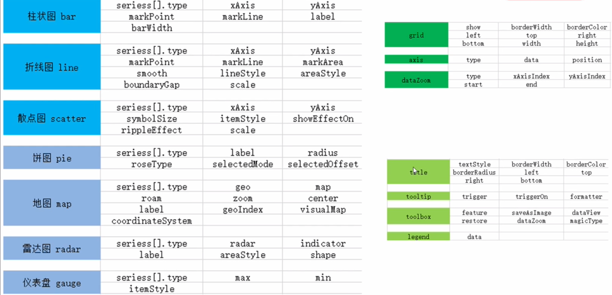

# Vue + Echarts
一端操作，多端联动：
两个浏览器，其中一个浏览器对界面进行更改，另外一个浏览器也会随之更改。

保证实时获取数据进行分析。

支持大屏展示，自适应分辨率。


## 技术选型
Echarts

Vue, Vue Router, VueX

webpack

axios

WebSocket：完成前后端数据的推送

Koa2：后端服务器开发

## Echarts
<b> 引入 echarts.js 文件 </b>
```JavaScript
    <!-- src 后是文件夹里 echarts.min.js 地址 -->
    <script src="./echarts.min.js"></script>
```

<b> 准备一个呈现图表的盒子 </b>
```JavaScript
    <div id="app"></div>
```

<b> 初始化 echarts 实例对象 </b>

```JavaScript
    <!-- 参数，dom，决定图表最终呈现的位置 -->
    var mCharts = echarts.init(document.querySelector('div'))
```

<b> 准备配置项 </b>

```JavaScript
      const option = {
        xAxis: {
          type: 'category'
        },
        yAxis: {
          value: 'value'
        },
        series: [
          {
            type: 'bar',
            label: {
              show: true,
              position: 'top',
              color: 'white',
              rotate: 30
            }
          }
        ]
      }
```

[echarts配置项](https://echarts.apache.org/zh/option.html#title)

<b> 将配置项设置给 echarts 实例对象 </b>

```JavaScript
  mCharts.setOption(option)
```

## 地图图表使用方式
### 百度地图 API
需要申请百度地图 ak

### 矢量地图
需要准备矢量地图数据，如 china.json

<b>使用 Ajax 获取 china.json</b>
需要引入jqeury
```JavaScript
    <script src="./jquery.min.js"></script>
```

```JavaScript
    var mCharts = echarts.init(document.querySelector('div'))

    $.get('/china.json', function(chinaJson){

        // 在回调函数中往 echarts 全局对象注册地图的 json 数据
        echarts.registerMap('chinaMap', chinaJson)
    })

    const option = {
        geo: { // 在geo下设置
            type: 'map'
            map: 'chinaMap' // 因为 registerMap 时给地图注册的名称叫 chinaMap
        }
    }

    mCharts.setOption(option)
```


## 图表 type
各个图表英文单词：

bar  line  scatter/effectScatter  pie  map  radar  gauge

## 图表配置基础项


## 定制主题
[定制主题](https://echarts.apache.org/zh/theme-builder.html)

<b>引入主题 js 文件</b>

```JavaScript
    <script src="./itcast.js"></script>

    // itcast 是看的 itcast.js 的代码：echarts.registerTheme('itcast', { 里的 itcast
    var mCharts = echarts.init(document.querySelector('div'), 'itcast')

```

## 图表自适应

```JavaScript
    // 监听 window 窗口大小变化事件
    window.onresize = function(){
        mCharts.resize()
    }

    // 下行代码功能同上
    window.onresize = mCharts.resize 
```

## 图表动画

加载动画

```JavaScript
    mCharts.showloading()
    mCharts.hideloading()
```

增量动画（增加或修改）

```JavaScript
    // 就是新设置 setoption
    mCharts.setOption(option) // setoption 可以设置多次，这里的 option 是新的，且只需要考虑到变化的部分
```

动画配置

```JavaScript
      const option = {
        animation: true // 默认就是开启
      }
```