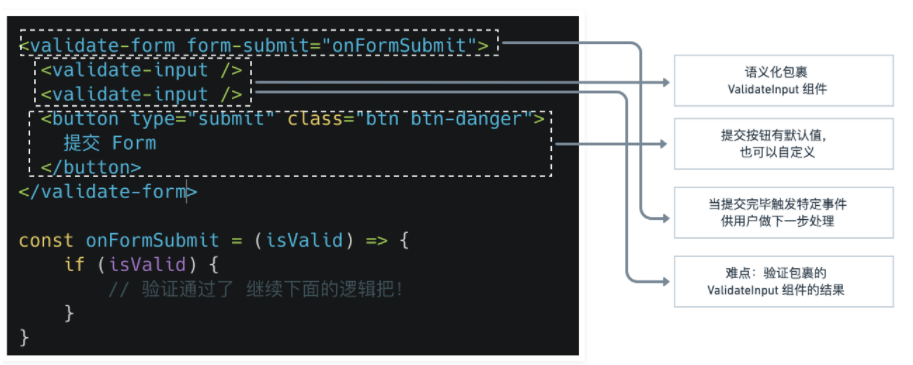

## 项目复杂点
数据结构比较复杂，覆盖了多层数据结构和依赖的情况，比如专栏和文章是一对多的结构，专栏和作者又是一一对应的。
创建文章处需要录入头图，文章详情的介绍需要支持 markdown，这里就需要一定的验证功能。表单的验证功能，和服务器交互的自定义验证功能，如需要检查用户名和邮箱是否已经被注册，且用户名的验证需要支持多种规则和自定义的验证（难点）。权限系统的实现和控制，需要客户有特定的权限才能进行数据的更新和录入。


eslint 格式选择 ESLint + Standard config
这个格式是。。。

## 开发流程
将 UI 划分出组件的层级
创建应用的静态版本（传入数据模型，渲染UI，但没有交互）

## 判断类型
|事件类型 | 名称 |
| :--:  |  :--:  |
|键盘输入事件 |KeyboardEvent |
|输入框等输入元素 | HTMLInputElement |
|点击事件 | MouseEvent |
|按钮等元素 | HTMLElement |

```JavaScript
<input type="email" class="form-control" id="exampleInputEmail1"
    :value="inputRef.val"
    @input="updateValue"
>

// 针对文本框等输入元素的输入事件 
const updateValue = (e: KeyboardEvent) => { // 键盘输入事件
    const targetValue = (e.target as HTMLInputElement).value // 输入元素 HTMLInputElement
}
```

```JavaScript
  const handler = (e: MouseEvent) => { // 设置类型为点击事件
    if (elementRef.value) { // 如果传进来的元素不是 null
      if (elementRef.value.contains(e.target as HTMLElement)) {
        isClickOutside.value = false
      } else {
        isClickOutside.value = true
      }
    }
  }
```


## 泛型定义数据类型
1. 定义一个 props 属性，希望一个 Array 是一个 ColumnProps 的数组（数组里存放的值的类型为 ColumnProps）

```JavaScript
// 这里的 export 是要导出定义的泛型，如果不要导出，就不需要写 export
export interface ColumnProps {
  id: number;
  title: string;
  avatar?: string;
  description: string;
}

props: {
  list: {
    // 这里特别有一点，我们现在的 Array 是没有类型的，
    // 只是一个数组，我们希望它是一个 ColomnProps 的数组，
    // 那么我们是否可以使用了类型断言直接写成 ColomnProps[]，显然是不行的 ，
    // 因为 Array 是一个数组的构造函数不是类型，我们可以使用 PropType 这个方法，它接受一个泛型，讲 Array 构造函数返回传入的泛型类型。
    type: Array as PropType<ColumnProps[]>,
    required: true
  }
},
```

2. 定义一个数据，为一个数组，里面存放的是函数，函数的类型为（输入的参数为空，返回的值类型为 boolean）

```JavaScript
// 首先定义一个函数类型，传入的参数为空，返回的值的类型是 boolean
type validateFunc = () => boolean

setup(){
    const funcArr: validateFunc[] = []
}
```

## 类型转换
### string类型 转换为 number类型
```JavaScript
const currentId = +route.params.id // route.params.id 获得的是一个 string 类型的值
```

## 通过 ref 获取对应的 dom 元素
```JavaScript
<div class="dropdown" ref="dropdownRef">

// 定义数据类型，可接收的类型有两种：null 和 HTMLElement，默认值为 null
const dropdownRef = ref<null | HTMLElement>(null)

return {
    // 返回和 ref 同名的响应式对象，就可以拿到对应的 dom 节点
    dropdownRef
}
```

### 判断是否点击在某个元素的外部
```JavaScript
<div class="dropdown" ref="dropdownRef">


const dropdownRef = ref<null | HTMLElement>(null)
// 因为它是一个点击事件，因此需要设置为 MouseEvent 
const handler = (e: MouseEvent) => {
  // 判断 dropdownRef 是否存在，dropdownRef 不是 null
  if (dropdownRef.value) {
    // dropdownRef.value.contains(e.target as HTMLElement) 判断是否点击在该元素的外部
    if (!dropdownRef.value.contains(e.target as HTMLElement) && isOpen.value) {
      isOpen.value = false
    }
  }
}
onMounted(() => {
  document.addEventListener('click', handler)
})
onUnmounted(() => {
  document.removeEventListener('click', handler)
})
return {
  isOpen,
  toggleOpen,
  dropdownRef
}
```

## 自定义公共函数
### 判断是否点击在元素外部的公共函数
```JavaScript
// 这里的 Ref 是一个类型，响应式对象
import { ref, onMounted, onUnmounted, Ref } from 'vue'
// 如果仅仅是一个 dom 节点，在 setup() 里调用，它是不会变化的，我们必须需要一个响应式对象，即 ref 对象
const useClickOutside = (elementRef: Ref<null | HTMLElement>) => {
  // 判断是否点击到了该元素的外面
  const isClickOutside = ref(false)
  const handler = (e: MouseEvent) => { // 设置类型为点击事件
    if (elementRef.value) { // 如果传进来的元素不是 null
      if (elementRef.value.contains(e.target as HTMLElement)) {
        isClickOutside.value = false
      } else {
        isClickOutside.value = true
      }
    }
  }
  onMounted(() => {
    document.addEventListener('click', handler)
  })
  onUnmounted(() => {
    document.removeEventListener('click', handler)
  })
//   return {
//     isClickOutside
//   }
  return isClickOutside // 不需要加上 { }，否则这里会多一层
}
export default useClickOutside
```

在其它文件里使用该函数

```JavaScript
import useClickOutside from '@/hooks/useClickOutside'

// 调用函数 useClickOutside
const isClickOutside = useClickOutside(dropdownRef) 

// 可以通过 watch 来监控响应式对象的变化
watch(isClickOutside, () => {
  if (isOpen.value && isClickOutside.value) {
    isOpen.value = false
  }
})
```

### 抽离验证规则，文本框执行从父组件传过来的验证规则

具体的验证规则是从父组件传过来的

定义的规则数据类型如下：<br>
```JavaScript
const emailRules: RulesProp = [
  { type: 'required', message: '电子邮箱地址不能为空' },
  { type: 'email', message: '请输入正确的电子邮箱格式' }
]
```

```JavaScript
<template>
    <input type="email" class="form-control" id="exampleInputEmail1"
            v-model="inputRef.val"
           @blur="validateInput"
    >
    <div id="emailHelp" class="form-text" v-if="inputRef.error">
      {{inputRef.message}}
    </div>
</template>

<script lang="ts">
import { defineComponent, reactive, PropType } from 'vue'

 interface RuleProp {
    // 这里就是用于区分每一种情况自定义的
    type: 'required' | 'email';
    message: string;
 }
//  设置一个 type ，是一个 存放类型为 RuleProp 数据的数组，然后将其导出
export type RulesProp = RuleProp[]

export default defineComponent({
  name: 'ValidateInput',
  props: {
    // 这个是用于接收在父组件定义的规则
    rules: Array as PropType<RulesProp>
  },
  setup (props) {
    // interface 和 reactive 的区别
    // reactive 和 ref ，都是创建数据, ref 是单个，reactive 是集中的一个对象
    const inputRef = reactive({
      val: '', // 文本框里输入的值
      error: false, // 验证结果是否错误
      message: '' // 验证错误时的提示信息
    })

    // 验证 Email 是否有效的正则表达式
    const emailReg = /^[a-zA-Z0-9.!#$%&’*+/=?^_`{|}~-]+@[a-zA-Z0-9-]+(?:\.[a-zA-Z0-9-]+)*$/

    const validateInput = () => {
      // 需要循环遍历每一条规则，只有输入的值对每一条设定的规则都通过，才算通过。
      if (props.rules) { // 如果有传过来的 props.rules
        const allPassed = props.rules.every(rule => {
          let passed = true
          inputRef.message = rule.message

          switch (rule.type) {
            case 'required':
            // inputRef.val.trim() !== null 这个就不会执行
              passed = (inputRef.val.trim() !== '')
              break
            case 'email':
              passed = emailReg.test(inputRef.val)
              break
            default:
              break
          }
          return passed
        })
        inputRef.error = !allPassed
        return allPassed
      } 
      return true
    } 

    return {
      inputRef,
      validateInput
    }
  }
})
</script>

<style>
</style>

```

## ColumnList 组件源代码

<!--  -->


 Array 是没有类型的，只是一个数组。需要让数组里存放的值的类型为自己定义的那一类，利用泛型。<br>
  Array as PropType<ColumnProps[]>，ColumnProps[] 是自定义的类型。

  子组件里不定义具体数据，只接收从父组件传过来的 list 数据。

```JavaScript
<template>
  <ul>
    <li v-for="column in list" :key="column.id">
      
      <h5>{{column.title}}</h5>
      <p>{{column.description}}</p>
      <a href="#">进入专栏</a>
    </li>
  </ul>
</template>

<script lang="ts">
import { defineComponent, PropType } from 'vue'
export interface ColumnProps {
  id: number;
  title: string;
  avatar: string;
  description: string;
}
export default defineComponent({
  name: 'ColumnList',
  props: {
    list: {
      //这里特别有一点，我们现在的 Array 是没有类型的，只是一个数组，我们希望它是一个 ColomnProps 的数组（数组里存放的值的类型为 ColumnProps）
      // 那么我们是否可以使用了类型断言直接写成 ColomnProps[]，显然是不行的
      // 因为 Array 是一个数组的构造函数不是类型，我们可以使用 PropType 这个方法
      // 它接受一个泛型，将 Array 构造函数返回传入的泛型类型。
      type: Array as PropType<ColumnProps[]>,
      required: true
    }
  }
})
</script>
```

App.vue 父组件里使用

```JavaScript
<template>
  <div class="container">
    <column-list :list = "list"></column-list>
  </div>
</template>

<script lang="ts">
import { defineComponent } from 'vue'
import 'bootstrap/dist/css/bootstrap.min.css'
// 将设置的 ColumnProps 也拿过来
import ColumnList, { ColumnProps } from '@/components/ColumnList.vue'

// 自定义 test 数据
const testData: ColumnProps[] = [
  {
    id: 1,
    title: 'test1的专栏',
    description: '这是的test1专栏，有一段非常有意思的简介，可以更新一下欧',
    avatar: 'http://vue-maker.oss-cn-hangzhou.aliyuncs.com/vue-marker/5ee22dd58b3c4520912b9470.jpg?x-oss-process=image/resize,m_pad,h_100,w_100'
  },
  {
    id: 2,
    title: 'test2的专栏',
    description: '这是的test2专栏，有一段非常有意思的简介，可以更新一下欧',
    avatar: 'http://vue-maker.oss-cn-hangzhou.aliyuncs.com/vue-marker/5ee22dd58b3c4520912b9470.jpg?x-oss-process=image/resize,m_pad,h_100,w_100'
  }
]

export default defineComponent({
  name: 'App',
  components: {
    ColumnList
  },
  setup () {
    return {
      list: testData
    }
  }
})
</script>

<style>
</style>

```

## ColumnList 组件使用 Bootstrap 美化
[Bootstrap card](https://getbootstrap.com/docs/5.0/components/card/)

[Bootstrap 栅格](ttps://v5.getbootstrap.com/docs/5.0/layout/grid/)

```JavaScript
  // 使用 Bootstrap 美化后的 card 
  <div class="row">
    // mb: margin-bottom
    //  columnList， 这是下面会新设置的一个数据对象
    <div v-for="column in columnList" :key="column.id" class="col-4 mb-4">
      <div class="card h-100 shadow-sm">
        <div class="card-body text-center">
          
          <h5 class="card-title">{{column.title}}</h5>
          <p class="card-text text-left">{{column.description}}</p>
          <a href="#" class="btn btn-outline-primary">进入专栏</a>
        </div>
      </div>
    </div>
  </div>
```

当有一个数据的 avatar数据 没有时，设置默认：

```JavaScript
  setup(props) {
    //   新设置一个对象数据
    const columnList = computed(() => {
      return props.list.map(column => {
        if (!column.avatar) {
          column.avatar = require('@/assets/column.jpg')
        }
        return column
      })
    })
    return {
      columnList
    }
  }
```

## 登录注册
GlobalHeader 组件 & DropDown 组件


### 头部组件（固定存在于所有界面） 

GlobalHeader 组件，之所以可以固定存在于所有界面的顶端，是因为会在 App.vue 里引用该组件，可以看第二步：引用 vue-router 后，会将所有的 url 跳转显示在 router-view，而 global-header 标签 在 router-view 前面。

[Bootstrap nav 样式文档地址](https://v5.getbootstrap.com/docs/5.0/components/navs/)

第一步：定义一个 header 子组件

1）分为 未登录 和 已登录 两种显示状况<br>
2）interface 一个 UserProps ，并且将其 export 出去<br>
3）用户的信息是从引用其的父组件里传来的，因此需要设置一个 props，接收传来的用户信息<br>
4）从父组件传来的用户信息是一个 object 类型的
```JavaScript
// import { defineComponent, PropType } from 'vue'
 type: Object as PropType<UserProps>  
```
5）父组件引用该组件后，user 属性是必传的 required: true

```JavaScript
<template>
  <nav class="navbar navbar-dark bg-primary justify-content-between mb-4 px-4">
    <a class="navbar-brand" href="#">者也专栏</a>

    // 未登录时
    <ul v-if="!user.isLogin" class="list-inline mb-0">
      <li class="list-inline-item"><a href="#" class="btn btn-outline-light my-2">登陆</a></li>
      <li class="list-inline-item"><a href="#" class="btn btn-outline-light my-2">注册</a></li>
    </ul>

    // 登录成功后
    <ul v-else class="list-inline mb-0">
      <li class="list-inline-item">
          // 使用了自定义的 dropDown 组件 和 自定义的 dropDownItem 组件，在后面内容
          <drop-down :title="`你好 ${user.name}`">
              // router-link to="/create"   
              <drop-down-item><router-link to="/create" class="dropdown-item">新建文章</router-link></drop-down-item>
              <drop-down-item><router-link :to="`/column/${user.column}`" class="dropdown-item">我的专栏</router-link></drop-down-item>
              <drop-down-item><a href="#" class="dropdown-item">退出登录</a></drop-down-item>
          </drop-down>
      </li>
    </ul>
  </nav>
</template>

<script lang="ts">
import { defineComponent, PropType } from 'vue'
export interface UserProps {
  isLogin: boolean;
  name?: string;
  id?: number;
}
export default defineComponent({
  name: 'GlobalHeader',
  props: {
    // 接收从父组件传来的用户信息，用户信息是一个 object，类型是 UserProps
    // 父组件引用该组件后，user 属性是必传的 required: true
    user: {
      type: Object as PropType<UserProps>, // Object 存储的数据类型值都是 UserProps 类型
      required: true
    }
  }
})
</script>
```

第二步：App.vue 父组件里使用，并且在父组件里传送具体数据。真实的用户信息之后可以存储在 vuex 里面，这里先暂时使用自定义的 test 数据。

```JavaScript
<global-header :user="currentUser"></global-header>
// 之后有引用 vue-router 后，会将所有的 url 跳转显示在 router-view
<router-view></router-view>

import GlobalHeader, { UserProps } from '@/components/GlobalHeader.vue'

// 自定义 GlobalHeader 的 test 数据
const currentUser: UserProps = {
  isLogin: false
}

export default defineComponent({
  name: 'App',
  components: {
    GlobalHeader
  },
  setup () {
    return {
      currentUser
    }
  }
})
```

### 自定义下拉框组件
该组件的功能有：当点击组件外部区域的时候，可以自动隐藏该组件。

DropDown 组件


定义一个 DropDown 子组件，组件的标题，即 UI 上的文字 “欢迎你 Viking”，是父组件传过来的

```JavaScript
<template>
<div class="dropdown">
  // @click.preven 阻止其默认行为
  <a href="#" class="btn btn-outline-light my-2 dropdown-toggle" @click.prevent="toggleOpen">
    {{title}}
  </a>

  // :style = "{display: 'block'}" 
  <ul class="dropdown-menu" :style="{display: 'block'}" v-if="isOpen">
    <li class="dropdown-item">
      <a href="#">新建文章</a>
    </li>
    <li class="dropdown-item">
      <a href="#">编辑资料</a>
    </li>
  </ul>
</div>
</template>

<script lang="ts">
import { defineComponent, ref } from 'vue'
export default defineComponent({
  name: 'DropDown',
  props: {
    title: {
      type: String,
      required: true
    }
  },
  setup () {
    const isOpen = ref(false)
    const toggleOpen = () => {
      isOpen.value = !isOpen.value
    }
    return {
      isOpen,
      toggleOpen
    }
  }
})
</script>
```

### 一个父组件中，子组件A 里放置 子组件B
这里是为 Dropdown 添加 DropdownItem

DropdownItem 子组件

```JavaScript
// DropdownItem 组件
<template>
  <li
    class="dropdown-option"
    :class="{'is-disabled': disabled}"
  >
    <slot></slot>
  </li>
</template>

<script lang="ts">
import { defineComponent } from 'vue'
export default defineComponent({
  props: {
    disabled: {
      type: Boolean,
      default: false
    }
  }
})
</script>

<style>
.dropdown-option.is-disabled * {
  color: #6c757d;
  pointer-events: none;
  background-color: transparent;
}
</style>

```

GlobalHeader 父组件 引入 DropdownItem 子组件

GlobalHeader 父组件 也引入了 Dropdown 子组件

```JavaScript
// 新增部分
// drop-down 子组件
<drop-down :title="`你好 ${user.name}`">
    // drop-down-item 子组件
    <drop-down-item><a href="#" class="dropdown-item">新建文章</a></drop-down-item>
    <drop-down-item><a href="#" class="dropdown-item">编辑资料</a></drop-down-item>
    <drop-down-item><a href="#" class="dropdown-item">退出登录</a></drop-down-item>
</drop-down>

import DropDownItem from '@/components/DropDownItem.vue'

```

DropDown子组件 和 DropdownItem子组件 在同一个父组件里被引用。在父组件里，DropDown子组件 里面要放置 DropdownItem子组件，因此在 DropDown子组件 的内部要添加 slot标签。

```JavaScript
// DropDown子组件 完整代码如下：
<template>
<div class="dropdown">
  <a href="#" class="btn btn-outline-light my-2 dropdown-toggle" @click.prevent="toggleOpen">
    {{title}}
  </a>

  <ul class="dropdown-menu" :style="{display: 'block'}" v-if="isOpen">
    // <li class="dropdown-item">
    //   <a href="#">新建文章</a>
    // </li>
    // <li class="dropdown-item">
    //   <a href="#">编辑资料</a>
    // </li> 

    // 添加 slot 标签
    <slot></slot>
  </ul>
</div>
</template>

<script lang="ts">
import { defineComponent, ref } from 'vue'
export default defineComponent({
  name: 'DropDown',
  props: {
    title: {
      type: String,
      required: true
    }
  },
  setup () {
    const isOpen = ref(false)
    const toggleOpen = () => {
      isOpen.value = !isOpen.value
    }
    return {
      isOpen,
      toggleOpen
    }
  }
})
</script>

```

### 点击元素外部隐藏
Dropdown 点击外部区域自动隐藏

1）返回和 ref 同名的响应式对象，可以拿到对应的 dom 节点<br>
2）判断当前点击位置是否在某一个节点里 .contains()<br>
3）在 onMounted 的时候，document.addEventListener 监听全局, 判断是否点击了指定区域<br>
4）在 onUnmounted 的时候，document.removeEventListener 清除监听

Dropdown 组件里添加

```JavaScript
    <div class="dropdown" ref="dropdownRef">


    const dropdownRef = ref<null | HTMLElement>(null)
    // 因为它是一个点击事件，因此需要设置为 MouseEvent 
    const handler = (e: MouseEvent) => {
      // 判断 dropdownRef 是否存在，而不是 null
      if (dropdownRef.value) {
        // 第一个是判断 dropdownRef.value 节点是否包含当前节点
        // 即当前点击的位置是否在 ref="dropdownRef" 的元素里
        // e.target as HTMLElement ，类型断言
        // 如果不断言，可能出现 e.target 为 null 的情况
        // setup() 里获取 props 属性的值，需要加 .value
        if (!dropdownRef.value.contains(e.target as HTMLElement) && isOpen.value) {
          isOpen.value = false
        }
      }
    }
    onMounted(() => {
      // .addEventListener() 用于向指定元素添加事件
      // document.addEventListener方法监听全局, 然后判断是否点击了指定区域
      document.addEventListener('click', handler)
    })
    onUnmounted(() => {
      document.removeEventListener('click', handler)
    })
    return {
      isOpen,
      // 返回和 ref 同名的响应式对象，就可以拿到对应的 dom 节点
      dropdownRef
    }
```

### 点击元素外部隐藏（抽离成公共函数）
判断是否点击到了一个 dom 元素的外面 （useClickOutside.ts）

第一个自定义元素，判断是否点击到了一个 dom 元素的外面

1) 函数里传入参数 dom 元素 elementRef: Ref<null | HTMLElement> <br>
2) 设置一个是否点击了元素外部的初始值，const isClickOutside = ref(false)<br>
3) 判断当前点击位置是否在某一个节点里 .contains()<br>
4) 在 onMounted 的时候，document.addEventListener 监听全局, 判断是否点击了指定区域<br>
5) 在 onUnmounted 的时候，document.removeEventListener 清除监听

```JavaScript
// 函数功能： 判断是否点击到了一个 dom 元素的外面
// 这里的 Ref 是一个类型，响应式对象
import { ref, onMounted, onUnmounted, Ref } from 'vue'
// 如果仅仅是一个 dom 节点，在 setup() 里调用，它是不会变化的，我们必须需要一个响应式对象，ref 对象
const useClickOutside = (elementRef: Ref<null | HTMLElement>) => {
  // 判断是否点击到了该元素的外面
  const isClickOutside = ref(false)
  const handler = (e: MouseEvent) => { // 设置类型为点击事件
    if (elementRef.value) { // 如果传进来的元素不是 null
      if (elementRef.value.contains(e.target as HTMLElement)) {
        isClickOutside.value = false
      } else {
        isClickOutside.value = true
      }
    }
  }
  onMounted(() => {
    document.addEventListener('click', handler)
  })
  onUnmounted(() => {
    document.removeEventListener('click', handler)
  })
//   return {
//     isClickOutside
//   }
  return isClickOutside // 不需要加上 { }，否则这里会多一层？？？为什么？？？？
}
export default useClickOutside

```

在 dropdown 组件里使用

```JavaScript
import { defineComponent, onMounted, ref, onUnmounted, watch } from 'vue'
import useClickOutside from '@/hooks/useClickOutside'

    const isClickOutside = useClickOutside(dropdownRef) // 因为函数的返回值是 true/false
    // 因为该组件是通过 isOpen 来控制 下拉板块的显示和隐藏，因此可以通过 isClickOutside 来相应的更改 isOpen 的值
    // 这时需要 watch 来监控响应式对象的变化
    watch(isClickOutside, () => {
      if (isOpen.value && isClickOutside.value) {
        isOpen.value = false
      }
    })


// 完整代码是：
<template>
  <div class="dropdown" ref="dropdownRef">
    <a
      href="#"
      class="btn btn-outline-light my-2 dropdown-toggle"
      @click.prevent="toggleOpen"
    >
      {{ title }}
    </a>

    <ul class="dropdown-menu" :style="{ display: 'block' }" v-if="isOpen">
      <slot></slot>
    </ul>
  </div>
</template>

<script lang="ts">
import { defineComponent, onMounted, ref, onUnmounted, watch } from 'vue'
import useClickOutside from '@/hooks/useClickOutside'
export default defineComponent({
  name: 'DropDown',
  props: {
    title: {
      type: String,
      required: true
    }
  },
  setup () {
    const isOpen = ref(false)
    const toggleOpen = () => {
      isOpen.value = !isOpen.value
    }

    // // 类型为 null 或 html元素节点
    const dropdownRef = ref<null | HTMLElement>(null)

    const isClickOutside = useClickOutside(dropdownRef) // 因为函数的返回值是 true/false
    // 因为该组件是通过 isOpen 来控制 下拉板块的显示和隐藏，因此可以通过 isClickOutside 来相应的更改 isOpen 的值
    // 这时需要 watch 来监控响应式对象的变化
    watch(isClickOutside, () => {
      if (isOpen.value && isClickOutside.value) {
        isOpen.value = false
      }
    })

    // const handler = (e: MouseEvent) => {
    //   if (dropdownRef.value) {
    //     if (!dropdownRef.value.contains(e.target as HTMLElement) && isOpen.value) {
    //       isOpen.value = false
    //     }
    //   }
    // }

    // onMounted(() => {
    //   // .addEventListener() 用于向指定元素添加事件
    //   // document.addEventListener方法监听全局, 然后判断是否点击了指定区域
    //   document.addEventListener('click', handler)
    // })

    // onUnmounted(() => {
    //   document.removeEventListener('click', handler)
    // })

    return {
      isOpen,
      toggleOpen,
      // 返回和 ref 同名的响应式对象，就可以拿到对应的 dom 节点
      dropdownRef
    }
  }
})
</script>

```

## 表单


### 表单验证
输入为空的时候，提示 "can not be empty"，输入的邮箱地址错误的时候，提示"should be valid email"

1) 创建一个 emailRef对象，里面有三个属性 val，error，message <br>
2) 在输入的 input文本框上添加 v-model = emailRef.val，用于获取输入的值。同时添加 @blur="validateEmail" 事件，让其失焦的时候就进行验证。<br>
3) 创建一个 验证表单函数 validateEmail

```JavaScript
<template>
    <form>
    <div class="mb-3">
        <label for="exampleInputEmail1" class="form-label">Email address</label>
        <input type="email" class="form-control" id="exampleInputEmail1"
                v-model="emailRef.val"
               @blur="validateEmail"
        >
        <div id="emailHelp" class="form-text" v-if="emailRef.error">{{emailRef.message}}</div>
    </div>
    <div class="mb-3">
        <label for="exampleInputPassword1" class="form-label">Password</label>
        <input type="password" class="form-control" id="exampleInputPassword1">
    </div>
    </form>
</template>

<script lang="ts">
import { defineComponent, reactive } from 'vue'

export default defineComponent({
  name: 'foRm',
  setup () {
    // 1.输入框里绑定了 v-model，v-model="emailRef.val"
    const emailRef = reactive({// reactive，和 ref 类似，只不过是一个对象，里面可以又多个值
      val: '', // 文本框里输入的值
      error: false, // 验证结果是否错误
      message: '' // 验证错误时的提示信息
    })

    // 验证 Email 是否有效的正则表达式
    const emailReg = /^[a-zA-Z0-9.!#$%&’*+/=?^_`{|}~-]+@[a-zA-Z0-9-]+(?:\.[a-zA-Z0-9-]+)*$/

    // 验证表单函数
    const validateEmail = () => {
      if (emailRef.val.trim() === '') { // 是否输入为空
        emailRef.error = true
        emailRef.message = 'can not be empty'
      } else if (!emailReg.test(emailRef.val)) { // 输入的 Email 格式是否正确
        emailRef.error = true
        emailRef.message = 'should be valid email'
      }
    }
    return {
      emailRef,
      validateEmail
    }
  }
})
</script>

<style>
</style>

```

### 抽离文本框，接收不同验证规则
抽离一个公共组件 ValidateInput.vue，里面接收从父组件传来的验证规则。这样就可以实现不同的父组件，验证规则不同。

子组件设置一个 存放类型为 RuleProp 数据的数组

```JavaScript
// 1. @blur="validateInput"
<input type="email" class="form-control" id="exampleInputEmail1"
        v-model="inputRef.val"
       @blur="validateInput"
>
<span v-if="inputRef.error" class="invalid-feedback">{{inputRef.message}}</span>

 interface RuleProp {
    type: 'required' | 'email';
    message: string;
 }
 // 设置一个 type ，是一个 存放类型为 RuleProp 数据的数组，然后将其导出
 export type RulesProp = RuleProp[]

 props: {
   // 这个是用于接收在父组件定义的规则
   rules: Array as PropType<RulesProp>
   // 规则不是必传的    
   // required: true
 }

  setup (props, context) {
    const validateInput = () => {
      // 2. 需要循环遍历每一条规则，只有输入的值对每一条设定的规则都通过，才算通过。
      if (props.rules) { // 因为规则不是必传的，因此如果有传过来的 props.rules
        const allPassed = props.rules.every(rule => {
          let passed = true
          // 可以直接设定显示的信息，因为用于显示信息的 dom 元素是根据  inputRef.error 显示的。如果通过的话，这个 dom 元素就不会显示。 
          inputRef.message = rule.message

          switch (rule.type) { // 根据不同的规则类型，分别进行判断
            case 'required':
            // inputRef.val.trim() !== null 这个就不会执行？？为什么
              passed = (inputRef.val.trim() !== '')
              break
            case 'email':
              passed = emailReg.test(inputRef.val)
              break
            default:
              break
          }
          return passed
        })
        inputRef.error = !allPassed
        return allPassed
      }
      return true // 没有传入规则，则是任意输入值都可通过
    }
  }
```

父组件 Form.vue 传递验证规则

```JavaScript
<validate-input :rules="emailRules"></validate-input>

import ValidateInput, { RulesProp } from '@/components/ValidateInput.vue'

const emailRules: RulesProp = [ // 每一条数据都是 RulesProp 类型
  { type: 'required', message: '电子邮箱地址不能为空' },
  { type: 'email', message: '请输入正确的电子邮箱格式' }
]

return {
  emailRules
}
```

### 父组件得到子组件文本框的值（自定义组件的 v-model 改造）
[vue3 改造 v-model](https://v3.cn.vuejs.org/guide/migration/v-model.html#v-model-%E5%8F%82%E6%95%B0)

支持父组件拿到子组件的值，并且及时响应在父组件的界面上

父组件里引入 ValidateInput.vue 的组件时，可以使用 v-model，从而可以在父组件获取得到子组件的文本框的值。

改造 ValidateInput.vue 使其支持 v-model ，总共有以下两步：

1.在自定义组件里创建一个 modelValue 的 props
```JavaScript
props: {
    modelValue: String
}
```

2.在更新值的时候，发送一个事件 'update:modelValue'
```JavaScript
context.emit('update:modelValue', targetValue)
```

#### 具体代码

父组件

```JavaScript
<template>
  // v-model 相当于 :value 和 @input
  <Son v-model="sonValue"></Son>
  {{sonValue}}
</template>

<script lang="ts">
// 拿到子组件 Son 的文本框的值
import { defineComponent, ref } from 'vue'
import Son from '@/components/Son.vue'

export default defineComponent({
  name: 'FatherVue',
  components: {
    Son
  },
  setup () {
    const sonValue = ref('viking') // 因为是要响应式的，因此需要时 ref 类型
    return {
      sonValue
    }
  }
})
</script>

```

子组件

```JavaScript
<template>
  <input type="text" :value="inputVal.val" @input="sendValue">
</template>

<script lang="ts">
// 拿到子组件 Son 的文本框的值
import { defineComponent, PropType, reactive } from 'vue'

export default defineComponent({
  name: 'Son1Vue',
  props: {
    modelValue: String // 父组件的 v-model 传值
  },
  setup (props, context) {
    const inputVal = reactive({
      val: props.modelValue || ''
    })
    const sendValue = (e: KeyboardEvent) => { // 键盘输入事件
      const targetValue = (e.target as HTMLInputElement).value
      inputVal.val = targetValue
      context.emit('update:modelValue', targetValue) // 传出事件
    }
    return {
      inputVal,
      sendValue
    }
  }
})
</script>

```

## attr
[非 Prop 的 Attribute](https://cn.vuejs.org/v2/guide/components-props.html#%E9%9D%9E-Prop-%E7%9A%84-Attribute)

[vue文档 禁用 Attribute 继承](https://cn.vuejs.org/v2/guide/components-props.html#%E7%A6%81%E7%94%A8-Attribute-%E7%BB%A7%E6%89%BF)

如果不设置任何东西的话，可以看到，添加在 节点 上的 placeholder 并没有生效，而是添加到其根节点上。

只有设置以下，才会出现：


子组件：

```JavaScript
// 1. v-bind="$attrs"
<input type="email" class="form-control" id="exampleInputEmail1"
       @blur="validateInput"
       :value="inputRef.val"
       @input="updateValue"
       v-bind="$attrs"
>

// 2. inheritAttrs: false
setup(){
  inheritAttrs: false, // 不希望继承
}
```

父组件：

```JavaScript
// 引用子组件的父节点上添加非 prop 属性，同时又不是 class/style 属性
// 这里添加的属性是 placeholder="请输入邮箱"
<validate-input :rules="emailRules" v-model="emailVal" placeholder="请输入邮箱"></validate-input>
```

### 插槽

[插槽](https://cn.vuejs.org/v2/guide/components-slots.html#%E5%85%B7%E5%90%8D%E6%8F%92%E6%A7%BD)

子组件：

```JavaScript
// validateForm.vue
<template>
  <form class="validate-form-container">
    // 1.匿名插槽   
    <slot name="default"></slot>
    <div class="submit-area" @click.prevent="submitForm">
    // 2.具名插槽 
      <slot name="submit">
        // 这个是默认的内容，什么都不添加的时候会显示这个默认的内容
        <button type="submit" class="btn btn-primary">提交</button>
      </slot>
    </div>
  </form>
</template>
```

父组件：

```JavaScript
// 引用 validateForm.vue 的父组件
// 3. v-slot:submit，简写是 #submit，这个是配合具名插槽使用
<template v-slot:submit>
  <span class='btn'>submit</span>
</template>
```

### 自定义事件名称
方法一：可以使用 Object 定义

方法二：使用数组定义触发事件 emits:[]

```JavaScript
export default defineComponent({
  emits: ['form-submit'], // 使用数组定义自定义触发事件
  setup(props, context) {
    const submitForm = () => {
      context.emit('form-submit', true)  
    }
    return {
      submitForm
    }
  }
})
```

<b>区别：之前的 update:modelValue</b>

```JavaScript
props: {
  modelValue: String // 定义了 props
}

const updateValue = (e: KeyboardEvent) => {
  const targetValue = (e.target as HTMLInputElement).value 
  inputRef.val = targetValue
  context.emit('update:modelValue', targetValue) // 事件名称为 'update:modelValue'，发送到父组件
}
```

### 在父组件中访问子组件里定义的方法
之前的 validateInput子组件 实现的功能是可以验证单个 input，每个单独的 input 都需要通过所有对其设置的所有规则。如果在一个父组件里引用了多个 validateInput子组件，需要循环验证每个 input 输入的值的有效性，并且将最终结果统一返回。

在父组件 Form.vue 中拿到子组件 ValidateInput.vue 表单的验证结果



#### 访问子组件实例或子元素（dom节点）

[访问子组件实例或子元素](https://cn.vuejs.org/v2/guide/components-edge-cases.html#%E8%AE%BF%E9%97%AE%E5%AD%90%E7%BB%84%E4%BB%B6%E5%AE%9E%E4%BE%8B%E6%88%96%E5%AD%90%E5%85%83%E7%B4%A0)，拿到子组件的实例后，就可以访问子组件上定义的方法。

为什么要获取它的方法？？？？？

1）通过 ref 获取同名的响应式对象
2）

```JavaScript
// 在父组件里获取引入的子组件实例：

// 1. ref 等于的值 和 setup() 里 return 的保持一致 
<validate-input v-model="emailVal" ref="inputRef"></validate-input>

  setup () {
    // 2.设置一个 ref 数据
    const inputRef = ref<any>()

    return {
      // 3. 返回和 ref 同名的响应式对象
      inputRef
    }
  }

// 这样在父组件的 setup() 里可以添加函数，在函数里通过 inputRef.value 就可以获取子组件实例。
```

<b>返回和 ref 同名的响应式对象，就可以拿到对应的 dom 节点</b>

```JavaScript
    // 1. 设置 ref 
    <div class="dropdown" ref="dropdownRef">

    // 2. 定义一个 ref 数据
    const dropdownRef = ref<null | HTMLElement>(null)
    
    const handler = (e: MouseEvent) => {
      if (dropdownRef.value) {
        if (!dropdownRef.value.contains(e.target as HTMLElement) && isOpen.value) {
          isOpen.value = false
        }
      }
    }
    onMounted(() => {
      document.addEventListener('click', handler)
    })
    onUnmounted(() => {
      document.removeEventListener('click', handler)
    })
    return {
      isOpen,
      toggleOpen,
      // 3. 返回和 ref 同名的响应式对象，就可以拿到对应的 dom 节点
      dropdownRef
    }
```

### A 子组件里 获取 B 子组件里定义的方法

```JavaScript
// 子组件 A ：ValidateForm.vue
// 因为 slot 标签里可能存在多个 input，因此没法用一个数组或变量来定义。
// slot 本身也不支持 ref 属性
<template>
  <form class="validate-form-container">
    // slot 标签   
    <slot name="default"></slot>
    <div class="submit-area" @click.prevent="submitForm">
      <slot name="submit">
        <button type="submit" class="btn btn-primary">提交</button>
      </slot>
    </div>
  </form>
</template>
```

```JavaScript
// 父组件里同时引入了 子组件 A（ValidateForm.vue）和 子组件 B（validateInput.vue）
<validate-form @form-submit="onFormSubmit">
  <div class="mb-3">
    <label class="form-label">邮箱地址</label>
    // 子组件 B 会插入到 子组件 A 的 slot 位置
    <validate-input
      :rules="emailRules" v-model="formData.email"
      placeholder="请输入邮箱地址"
      type="text"
    />
  </div>
</validate-form>
```

这个是在 A 子组件里 获取 B 子组件里的方法。由于 slot 的特殊性，因此需要利用 事件侦听器，但是在 vue3 中已经废弃了 $on， $once， $off等，因此需要借助外部的库如 mitt。

[程序化的事件侦听器](https://cn.vuejs.org/v2/guide/components-edge-cases.html#%E7%A8%8B%E5%BA%8F%E5%8C%96%E7%9A%84%E4%BA%8B%E4%BB%B6%E4%BE%A6%E5%90%AC%E5%99%A8)

1) 在子组件 A 中创建一个事件侦听器<br>
2) 在子组件 B 中通过某种方法，往该侦听器中手动触发事件<br>

在 子组件 A (FormValidated.vue) 中创建一个事件监听

```JavaScript
// 安装 mitt ；npm install --save mitt
// 1. 引入
import mitt from 'mitt'

// 2. 创建一个监听器
// 因为需要拿给 B 子组件使用，因此需要 export
export const emitter = mitt()

setup () {
    const callback = (test: string | any) => {
        console.log(test)
    }
    emitter.on('form-item-created', callback) // 自定义名称 form-item-created
    onUnmounted(() => {
        emitter.off('form-item-created', callback) // 即使清除
    })
}

```

在 子组件 B （validateInput.vue）中发送信息

```JavaScript
// 1. 导入监听器
import { emitter } from './FormValidated.vue'

onMounted(() => {
    emitter.emit('form-item-created', inputRef.val)
})

```

#### $parent

```JavaScript
// 和 $root 类似，$parent property 可以用来从一个子组件访问父组件的实例。
this.$parent.emit('item-created', validateInput)
```

### 循环验证一个表单里的所有文本框
1）在子组件 B 中，将验证函数的实体传递过去，即定义的验证方法<br>
2）子组件 A 中，创立一个数组 funcArr，将 validate function 都放到数组里去<br>

子组件 B （validateInput.vue）

```JavaScript
import { emitter } from './FormValidated.vue'

    const validateInput = () => {
      if (props.rules) { 
        const allPassed = props.rules.every(rule => {
          let passed = true
          inputRef.message = rule.message

          switch (rule.type) {
            case 'required':
              passed = (inputRef.val.trim() !== '')
              break
            case 'email':
              passed = emailReg.test(inputRef.val)
              break
            default:
              break
          }
          return passed
        })
        inputRef.error = !allPassed
        console.log('allPassed==', allPassed)
        return allPassed
      }
      return true
    }

    // 子组件 B 中将验证方法传递过去
    onMounted(() => {
        emitter.emit('form-item-created', validateInput)
    })
```

子组件 A （ValidateForm.vue）

```JavaScript
// 安装 mitt ；npm install --save mitt
// 1. 引入
import mitt from 'mitt'

// 2. 创建一个监听器
// 因为需要拿给 B 子组件使用，因此需要 export
export const emitter = mitt()

type ValidateFunc = () => boolean

setup () {
    let funcArr: ValidateFunc = [] // 存放一系列的函数，可以显示错误的信息，并且返回 input 是否通过

    const callback = (func: ValidateFunc | any) => {
        funcArr.push(func)
    }
    emitter.on('form-item-created', callback) // 自定义名称 form-item-created
    onUnmounted(() => {
        emitter.off('form-item-created', callback) // 即使清除
        funcArr = []
    })

    // 在点击 “提交” 的按钮时
    // 循环调用所有方法，并且将方法得到的值返回
    const submitForm = () => {
    //  const result = funcArr.every(func => func())
    // 因为 every 只要又一个是 false，就会提前终止循环，这样可能导致数组里的每个函数不会都运行一遍
    // 为了让数组里的所有函数都运行一遍，并且都返回相应的结果
    // map 会返回一个同等长度的数组
      const result = funcArr.map(func => func()).every(res => res)

      // 发送一个自定义的 form-submit 事件，并且将验证结果返回
      context.emit('form-submit', result)
    }
}
```

### ？？？？这个是啥

子组件 FormValidated.vue

```JavaScript
<template>
  <form class="validate-form-container">
    <slot name="default"></slot>
    <div class="submit-area" @click.prevent="submitForm">
      <slot name="submit">
        <button type="submit" class="btn btn-primary">提交</button>
      </slot>
    </div>
  </form>
</template>

<script lang="ts">
import { defineComponent, onUnmounted } from 'vue'

import mitt from 'mitt'

export const emitter = mitt()

// 1. 创建一个函数，传入的参数为空，返回的值的类型是 boolean
type validateFunc = () => boolean

export default defineComponent({
  name: 'FormValidate',
  emits: ['form-submit'],
  setup (props, context) {
    // 2. 存放一系列的函数，用来显示错误的信息并且返回这个 input 是否通过
    const funcArr: validateFunc[] = []

    // 4. 循环调用 ValidateInput.vue 中的方法，并且返回所有结果的最终值
    // 最后通过 emit 将事件发送出去
    const submitForm = () => {
      // 循环调用所有方法，并且将方法得到的值返回
    //   const result = funcArr.every(func => func())
    // 因为 every 只要又一个是 false，就会提前终止循环，这样可能导致数组里的每个函数不会都运行一遍
    // 为了让数组里的所有函数都运行一遍，并且都返回相应的结果
    // map 会返回一个同等长度的数组
      const result = funcArr.map(func => func()).every(res => res)
      context.emit('form-submit', result)
    }

    // 3. callback 接收的是一个 function，function 的类型是 validateFunc
    const callback = (func: validateFunc | any) => {
      funcArr.push(func)
    }

    emitter.on('form-item-created', callback)

    onUnmounted(() => {
      emitter.off('form-item-created', callback)
    })
    return {
      submitForm
    }
  }
})
</script>

<style>
</style>

```

父组件 Form.vue

```JavaScript
<template>
    <form-validate @form-submit="FromSubmit">
        <div class="mb-3">
            <label for="exampleInputEmail1" class="form-label">Email address</label>
            <validate-input :rules="emailRules" v-model="emailVal" placeholder="请输入邮箱" ref="inputRef"></validate-input>
        </div>
        <div class="mb-3">
            <label for="exampleInputPassword1" class="form-label">Password</label>
            <input type="password" class="form-control" id="exampleInputPassword1">
        </div>
        <template #submit>
            <button>提交1111</button>
        </template>
    </form-validate>
</template>

<script lang="ts">
import { defineComponent, ref } from 'vue'
import ValidateInput, { RulesProp } from '@/components/ValidateInput.vue'
import FormValidate from '@/components/FormValidated.vue'

export default defineComponent({
  name: 'foRm',
  components: {
    ValidateInput,
    FormValidate
  },
  setup () {
    const inputRef = ref<any>()
    const emailVal = ref('viking')
    const emailRules: RulesProp = [
      { type: 'required', message: '电子邮箱地址不能为空' },
      { type: 'email', message: '请输入正确的电子邮箱格式' }
    ]
    const FromSubmit = (result: boolean) => {
    // 5. 将相应的结果打印出来
      console.log('result', result)
    }
    return {
      emailRules,
      emailVal,
      FromSubmit,
      inputRef
    }
  }
})
</script>

<style>
</style>

```

## vue-Router 路由
安装路由插件 npm install vue-router@next --save

配置路由，在 main.ts 里完成

```JavaScript
import { createRouter, createWebHistory } from 'vue-router'

const router = createRouter({
  // history 决定采用哪种类型的路由
  history: createWebHistory(),
  routes: [
    {
      path: '/',
      name: 'home',
      component: () => import('./views/Home.vue')
    },
    {
      path: '/login',
      name: 'login',
      component: () => import('./views/Login.vue')
    }
  ]
})

const app = createApp(App)
app.use(router)
app.mount('#app')
```

添加对应的跳转路由链接 vue-router

```JavaScript
    <router-link class="navbar-brand" to="/">跳转到首页</router-link>
```

### 动态路由
比如需要通过获取路由上的传来的 id ，从而获取对应的内容。


[动态路由匹配](https://router.vuejs.org/zh/guide/essentials/dynamic-matching.html)

```JavaScript
const router = createRouter({
  // 决定采用哪种类型的路由
  history: createWebHistory(),
  routes: [
    {
      // 使用 ：
      path: '/column/:id', // 这个是动态路由参数
      name: 'ColumnDetail',
      component: () => import('./views/ColumnDetail.vue')
    }
  ]
})
```

### router-link 组件跳转的方式

<b>to</b>

我们第一种方法可以将 to 改成不是字符串类型，而是 object 类型，这个object 应该有你要前往route 的 name ，还有对应的 params。

```JavaScript
 :to="{ name: 'column', params: { id: column.id }}"
 ```

第二种格式，我们可以在里面传递一个模版字符串，这里面把 column.id 填充进去就好。

```JavaScript
 :to="`/column/${column.id}`"
 ```

<b>router.push</b>

```JavaScript
// useRoute，是获得路由信息 ， useRouter，是定义路由的一系列行为
// useRoute 是一个函数，调用后可以返回对应的对象
const router = useRouter()

router.push({ name: 'column', params: { id: column.id }})
 ```

### useRoute & useRouter
useRoute，是获得路由信息 ， useRouter，是定义路由的一系列行为
 
```JavaScript
import { useRoute } from 'vue-router' // 获取路由信息

const route = useRoute()
 ```

```JavaScript
const router = useRouter() // 定义路由的一系列行为

router.push({ name: 'column', params: { id: column.id }})
 ```

#### 展示某个栏目下的文章列表

父组件 ColumnDetail.vue

```JavaScript
<template>
  <div class="column-detail-page w-75 mx-auto">
    <div class="column-info row mb-4 border-bottom pb-4 align-items-center" v-if="column">
      <div class="col-3 text-center">
        
      </div>
      <div class="col-9">
        <h4>{{column.title}}</h4>
        <p class="text-muted">{{column.description}}</p>
      </div>
    </div>
    // 3. 传到子组件
    <post-list :list="list"></post-list>
  </div>
</template>

<script lang="ts">
import { defineComponent, computed, onMounted } from 'vue'
import { useRoute } from 'vue-router'
// 1.获取 testData 里的数据
import { testColumnData, testPostsData } from '../testData'
import PostList from '../components/PostList.vue'

export default defineComponent({
  components: {
    PostList
  },
  setup() {
    const route = useRoute()
    const currentId = +route.params.id // route.params.id 获得的是一个 string 类型的值

    // 获取当前的栏目
    const column = testColumnData.find(c => c.id === currentId)
    // 2. 筛选出符合当前路由条件的数据，然后将其传到子组件
    // 获取当前栏目下的所有文章
    const list = testPostsData.filter(p => p.columnId === currentId)

    return {
      column,
      list
    }
  }
})
</script>

```

子组件 PostList，list 属性接收从父组件传来的数据

```JavaScript
<template>
  <div class="post-list">
    <article v-for="post in posts" :key="post._id" class="card mb-3 shadow-sm">
      <div class="card-body">
        <h4>{{post.title}}</h4>
        <div class="row my-3 align-items-center">
          <div v-if="post.image" class="col-4">
            
          </div>
          <p :class="{'col-8': post.image}" class="text-muted">{{post.content}}</p>
        </div>
        <span class="text-muted">{{post.createdAt}}</span>
      </div>
    </article>
  </div>
</template>

<script lang="ts">
import { defineComponent, PropType, computed } from 'vue'
import { PostProps } from '../testData'
export default defineComponent({
  props: {
    list: {
      required: true,
      type: Array as PropType<PostProps[]>
    }
  },
  setup (props) {
    const posts = computed(() => {
      return props.list.map(post => {
        return post
      })
    })
    return {
      posts
    }
  }
})
</script>

<style scoped>
.post-list h4 a {
  text-decoration: none;
  color:#1a1a1a;
}
.post-list h4 a:hover {
  color:#0d6efd;
}
</style>


```

测试数据

```JavaScript
export interface ColumnProps {
  id: number;
  title: string;
  avatar?: string;
  description: string;
  // 不需要下面这行代码这样的结构
  // posts: PostProps[];
  // 那是如何将 ColumnProps 和 PostProps 联系起来的呢？
  // ColumnProps 代表不同的专栏， PostProps 代表同一个专栏下的不同文章
}
export interface PostProps {
  id: number;
  title: string;
  content: string;
  image?: string;
  createdAt: string;
  columnId: number;
}
export const testColumnData: ColumnProps[] = [
  {
    id: 1,
    title: 'test1的专栏',
    description: '这是的test1专栏，有一段非常有意思的简介，可以更新一下欧, 这是的test1专栏，有一段非常有意思的简介，可以更新一下欧',
    avatar: 'http://vue-maker.oss-cn-hangzhou.aliyuncs.com/vue-marker/5ee22dd58b3c4520912b9470.jpg?x-oss-process=image/resize,m_pad,h_150,w_150'
  },
  {
    id: 2,
    title: 'test2的专栏',
    description: '这是的test2专栏，有一段非常有意思的简介，可以更新一下欧',
    avatar: 'http://vue-maker.oss-cn-hangzhou.aliyuncs.com/vue-marker/5ee22dd58b3c4520912b9470.jpg?x-oss-process=image/resize,m_pad,h_100,w_100'
  },
  {
    id: 3,
    title: 'test3的专栏',
    description: '这是的test1专栏，有一段非常有意思的简介，可以更新一下欧 这是的test1专栏，有一段非常有意思的简介，可以更新一下欧'
    // avatar: 'http://vue-maker.oss-cn-hangzhou.aliyuncs.com/vue-marker/5ee22dd58b3c4520912b9470.jpg?x-oss-process=image/resize,m_pad,h_100,w_100'
  },
  {
    id: 4,
    title: 'test4的专栏',
    description: '这是的test2专栏，有一段非常有意思的简介，可以更新一下欧',
    avatar: 'http://vue-maker.oss-cn-hangzhou.aliyuncs.com/vue-marker/5ee22dd58b3c4520912b9470.jpg?x-oss-process=image/resize,m_pad,h_100,w_100'
  }
]

export const testPostsData: PostProps[] = [
  {
    id: 1,
    title: '这是我的第一篇文章',
    content: '"this is a new post you Very often we will need to map routes with the given pattern to the same component. For example we may have a User component which should be rendered for all users but with dif..."',
    image: 'http://vue-maker.oss-cn-hangzhou.aliyuncs.com/vue-marker/5ee1980819f4ae08ac78d458.png?x-oss-process=image/resize,m_fill,m_pad,w_200,h_110',
    createdAt: '2020-06-11 10:34:22',
    columnId: 1
  },
  {
    id: 2,
    title: '这是我的第二篇文章',
    content: '"this is a new post you Very often we will need to map routes with the given pattern to the same component. For example we may have a User component which should be rendered for all users but with dif..."',
    createdAt: '2020-06-11 10:34:22',
    columnId: 1
  },
  {
    id: 3,
    title: '这是我的第三篇文章',
    content: '"this is a new post you Very often we will need to map routes with the given pattern to the same component. For example we may have a User component which should be rendered for all users but with dif..."',
    image: 'https://vue-maker.oss-cn-hangzhou.aliyuncs.com/vue-marker/5edcc2329f2b4e28352b75eb.jpg?x-oss-process=image/resize,m_fill,m_pad,w_200,h_110',
    createdAt: '2020-06-11 10:34:22',
    columnId: 1
  }
]

```

### 路由守卫

[导航守卫](https://router.vuejs.org/zh/guide/advanced/navigation-guards.html)

当没有登录的时候就跳转到登录页面。登录完成就跳转到首页。

在 main.ts 文件里添加：

```JavaScript
router.beforeEach((to, from, next) => {
  if (to.name !== 'login' && !store.state.user.isLogin) {
    next({ name: 'login' })
  } else {
    next()
  }
})
```

### 添加元信息 meta

存在有的页面没有登录的时候，也可以进入，因此还需要修改以上代码。

[路由元信息 meta](https://router.vuejs.org/zh/guide/advanced/meta.html)

```JavaScript
    {
      path: '/login',
      name: 'login',
      component: Login,
      // 添加元信息，meta
      meta: { redirectAlreadyLogin: true }
    },
    {
      path: '/create',
      name: 'create',
      component: CreatePost,
      meta: { requiredLogin: true }
    },
```

更新路由守卫

```JavaScript
router.beforeEach((to, from, next) => {
  console.log(to.meta)
  if (to.meta.requiredLogin && !store.state.user.isLogin) {
    next({ name: 'login' })
  } else if (to.meta.redirectAlreadyLogin && store.state.user.isLogin) {
    next('/')
  } else {
    next()
  }
})
```

## vueX

| vuex属性 |  获取/更改值  |
| :-- | :--:  |
| state: { <br> count: 0 <br> }     |  store.state.count |
|mutation 里的必须是同步函数，因此可以使用 actions。 <br>  mutaitions: { <br> add (state) { <br> state.count++ <br>} <br> } |  store.commit('add) |
| getters: { <br> biggerColumnsLen(state) { <br> return state.columns.filter(c => c.id > 2).length <br> } <br> } |      store.getters.biggerColumnsLen    |
| actions: { <br>  fetchColumns (context) { <br> axios.get('/columns').then(res => { <br> context.commit('fetchColumns', res.data) <br> }) <br> } <br> }|  store.dispatch('fetchColumns') |

```JavaScript
import { createStore } from 'vuex'
const store = createStore({
  state: {
    count: 0
  },  
})

console.log('store', store.state.count)

// mutation 非常类似于事件：每个 mutation 都有一个字符串的 事件类型 (type) 和 一个 回调函数 (handler)。
// 这个回调函数就是实际进行状态更改的地方，并且它会接受 state 作为第一个参数：
  mutations: {
    // add 是自定义的名称  
    add (state) {
      state.count++
    }
  }
  
// 调用 store.commit 方法：
store.commit('add')
```

### 创建一个 store.ts 文件
```JavaScript
import { createStore } from 'vuex'
// 从存储数据的文件里拿到对应的数据
import { testData, testPosts, ColumnProps, PostProps } from './testData'
interface UserProps {
  isLogin: boolean;
  name?: string;
  id?: number;
}
export interface GlobalDataProps {
  columns: ColumnProps[];
  posts: PostProps[];
  user: UserProps;
}
const store = createStore<GlobalDataProps>({
  state: {
    // 将拿到的数据存在 state 里
    columns: testData,
    posts: testPosts,
    user: { isLogin: false }
  },
  mutations: {
    // 点击 “ 登录” 按钮时，想要界面发生相应的变化
    login(state) {
      // 新对象替换老对象 
      // 没变的属性保持之前的   
      state.user = { ...state.user, isLogin: true, name: 'viking' }
    }
  },
  getters: {
    biggerColumnsLen(state) {
      return state.columns.filter(c => c.id > 2).length
    }
  }
})

export default store

```

### 在 main.ts 里引入 store.ts 文件
```JavaScript
import { createApp } from 'vue'
import App from './App.vue'
import store from './store'

const app = createApp(App)
app.use(store)
app.mount('#app')
// createApp(App).mount('#app')
```

### 在 vue 文件里使用
```JavaScript
// 1. import { useStore } from 'vuex'
import { useStore } from 'vuex' // 可以和 useRoute，useRouter 一起记忆，使用方法类似
import { GlobalDataProps } from '../store'

// 这里的 GlobalDataProps 是在 vuex 里定义的该变量的数据类型
// 如果 vuex 里没定义类型，则不需要有泛型
// 2. const store = useStore()
const store = useStore<GlobalDataProps>()

// 3-1. store.state.XX
const list = computed(() => store.state.columns)

// 3-2 store.commit('XX')

// 3-3. store.getters.XX
const biggerColumnsLen = computed(()=>store.getters.biggerColumnsLen)
```

在 columnDetail 页面里 查询具体是哪个 column

```JavaScript
// 在 store.ts 文件里，定义 getters
  getters: { // 相当于计算属性
    // 返回的是一个函数
    getColumnById: (state) => (id: number) => {
      return state.columns.find(c => c.id === id)
    },
    getPostsByCid: (state) => (id: number) => {
      return state.posts.filter(post => post.columnId === id)
    }
  }


// 在使用 vuex 数据的文件里 

// const column = computed(() => store.state.columns.find(c => c.id ===currentId))
// const list = computed(() => store.state.posts.find(p => p.columnId ===currentId))

// 因为在 store 里定义了 getter，返回两个 函数，可以 替换上面的两行代码
const column = computed(() => store.getters.getColumnById(currentId))
const list = computed(() => store.getters.getPostsByCid(currentId))
```

向 store.commit 传入额外的参数，即 mutation 的载荷（payload）

[提交载荷](https://vuex.vuejs.org/zh/guide/mutations.html#%E6%8F%90%E4%BA%A4%E8%BD%BD%E8%8D%B7%EF%BC%88payload%EF%BC%89)

```JavaScript
mutations: {
  increment (state, n) {
    state.count += n
  }
}
```

```JavaScript
store.commit('increment', 10)
```

### 判断显示哪个节点
自创建的一个公共组件 A，其它文件引用 A 的时候，需要分别让 A 的不同 dom 元素进行显示。比如在 B 文件里，是显示 A 的 input输入框，C 文件里，是要显示 A 的 textarea。

在自定义的公共组件 A 里，添加以下代码：

【 这里是在 ValidateInput 文件里添加 】
```JavaScript
export type TagType = 'input' | 'textarea'

import { PropType } from 'vue'

props:{
    tag: {
        type: String as PropType<TagType>,
        default: 'input' // 设置默认值
    }
}
```

### (这是插入的，是之前的内容)自定义一个验证表单
？？？ 笔记没看完，从 “父子组件通讯” 到 “点击按钮循环验证表单的每个 input 值”  还没看

### 向某个栏目里新增一篇文章 


如下图所示，一个栏目下会有多个文章，可通过 columnId 判断该文章是哪个栏目下的。


只有在登录状态下，才能新建文章。创建文章的时候，也需要拿到它的 columnId，即是在哪个栏目下创建的这个文章。每个用户只可以在自己的栏目下创建文章吗？？？？这里设计的是在 vuex 存储的用户信息里，新添加 columnId 这个属性。

<b>1. 利用 vuex， store.ts 里面存放所有文章的信息数据</b>

store.ts 文件

```JavaScript
import { createStore } from 'vuex'
import { testData, testPosts, ColumnProps, PostProps } from './testData'

interface UserProps {
  isLogin: boolean;
  name?: string;
  id?: number;
  // 1. 新添加一个 columnId 属性
  columnId?: number;
}
export interface GlobalDataProps {
  columns: ColumnProps[];
  posts: PostProps[];
  user: UserProps;
}
const store = createStore<GlobalDataProps>({
  state: {
    columns: testData,
    posts: testPosts,
    // 2. 设计的只有在登录状态下才能推送文章
    // 为了测试，先设置登录状态为 true
    user: { isLogin: true, name: 'viking', columnId: 1 }
  },
  mutations: {
    login (state) {
      state.user = { ...state.user, isLogin: true, name: 'viking' }
    },
    // 3. state.commit 的时候，需要将新建的文章信息传递过来
    // 提交载荷（ payload ）
    createPost (state, newPost) {
      state.posts.push(newPost)
    }
  },
  getters: {
    getColumnById: (state) => (id: number) => {
      return state.columns.find(c => c.id === id)
    },
    getPostsByCid: (state) => (id: number) => {
      return state.posts.filter(post => post.columnId === id)
    }
  }
})

export default store

```

<b>2. 在新推文章的页面（CreatePost.vue）</b>

```JavaScript
// 点击 “发表文章” 按钮就新增一篇文章
// validate-form，validate-input 是自定义的组件，查看之前的笔记

// 1. onFormSubmit，点击的时候就上传一篇文章
<template>
  <div class="create-post-page">
    <validate-form @form-submit="onFormSubmit">
        <div class="mb-3">
          <label class="form-label">文章标题：</label>
          <validate-input
            :rules="titleRules" v-model="titleVal"
            placeholder="请输入文章标题"
            type="text"
          />
        </div>
        <div class="mb-3">
          <label class="form-label">文章详情：</label>
          <validate-input
            placeholder="请输入文章详情"
            :rules="contentRules"
            v-model="contentVal"
          />
        </div>
        <template #submit>
          <button class="btn btn-primary btn-large">{{isEditMode ? '更新文章' : '发表文章'}}
          </button>
        </template>
    </validate-form>
  </div>
</template>

<script lang="ts">
import { defineComponent, ref, onMounted } from 'vue'
import { useStore } from 'vuex'
import { useRouter, useRoute } from 'vue-router'
import { GlobalDataProps } from '../store'
import ValidateForm from '../components/FormValidated.vue'
import ValidateInput, { RulesProp } from '../components/ValidateInput.vue'

export default defineComponent({
  name: 'CreatePost',
  components: {
    ValidateInput,
    ValidateForm
  },
  setup () {
    const store = useStore<GlobalDataProps>()
    const router = useRouter()
    const titleVal = ref('')
    const contentVal = ref('')

    // 2. 对 vuex 存储的数据进行的操作
    const onFormSubmit = (result: boolean) => {
      if (result) {
      // 拿到 columnId
        const { columnId } = store.state.user
        if (columnId) { // 因为 columnId 有可能是 undefined
          const newPost = { // 前端先模拟的数据
            id: new Date().getTime(),
            title: titleVal.value,
            content: contentVal.value,
            columnId,
            createAt: new Date().toLocaleString()
          }
          // 提交载荷（ payload ）
          store.commit('createPost', newPost)
          console.log('列表文章', store.state.posts)
          // 提交完毕后自动跳转到文章列表页
          router.push({ name: 'column', params: { id: columnId } })
        //   router.push(`/column/${columnId}`)
        }
      }
    }
    return {
      titleVal,
      contentVal,
      onFormSubmit
    }
  }
})
</script>

```

### vuex action 发送异步请求（API）

vuex 文档里规定了 mutation 必须是同步函数。所有的 api 请求都是异步的。

在 store.ts 文件里：

```JavaScript
import axios, { AxiosRequestConfig } from 'axios'

mutations: {
    // 创建一个对应的 mutation 来处理 actions 里的 commit
    fetchColumns (state, rowdata) { // 这里的 rowdata 是 载荷，这里是 mutation 里传来的 res.data
       state.columns = rowdata.data.list
    },
    fetchColumn (state, rowdata) {
       state.columns = [ rowdata.data ]
    }
},
actions: {
    // 发送 get 请求 
    fetchColumns (context) { // 调用 API 是异步函数，将调用异步函数获得的返回值，传给使用该 action 的文件
      axios.get('/columns').then(res => {
        // 这里的 context 相当于 store，但是又不是 store
        // 下面这行代码的意思是调用 mutations 里面的 fetchColumns 函数，并且传过去一个载荷 res.data
        context.commit('fetchColumns', res.data)
      })
    },
    fetchColumn( { commit }, cid ) { // 解构赋值直接取出 commit
        axios.get(`/columns/${cid}`).then(res => {
            commit('fetchColumn', res.data) // 直接使用取出的 commit
        }
    }
}
```

在页面里调用该 action

```JavaScript
onMounted(() => {
    store.dispatch('fetchColumns')
    store.dispatch('fetchColumn', currentId) // action 同 mutation，也可以传一个载荷
})
```

### 组合 action
[vuex 组合 action](https://vuex.vuejs.org/zh/guide/actions.html#%E7%BB%84%E5%90%88-action)

场景：JWT，需要先调用 登录接口 获得 token 信息，然后再将 Token 信息传递，从而调用获取用户信息的接口。

```JavaScript
actions: {
  async actionA ({ commit }) {
    commit('gotData', await getData())
  },
  async actionB ({ dispatch, commit }) {
    await dispatch('actionA') // 等待 actionA 完成
    commit('gotOtherData', await getOtherData())
  }
}
```

## axios
### baseURL
```JavaScript
axios.defaults.baseURL = 'http://apis.imooc.com/api/'
axios.get('/column?icode=CA6A1080').then(res => {
    console.log('res', res.data)
})
```

不想每次都写一长串，希望通过某种方式直接往路由上添加相应的参数，如上面的 icode。可以使用拦截器 Interceptors。

### 拦截器 Interceptors
[github axios interceptors](https://github.com/axios/axios#interceptors)

```JavaScript
axios.defaults.baseURL = 'http://apis.imooc.com/api/'
// axios.get('/column?icode=CA6A1080').then(res => {
//     console.log('res', res.data)
// })
// 注释的代码可以改写成下面这样：
axios.interceptors.request.use( (config) => {
    // 设置它的参数
    config.params = { ...config.params, icode: 'CA6A1080' }
    return config
}
axios.get('/columns').then(res => {
    console.log('res', res.data)
})

// 还可以添加其它的参数，不会互相影响
// 即下面新添加的参数 key 和之前添加的参数 icode 不会互相影响
// 最终可以看到请求的 URL 是 http://apis.imooc.com/api/columns？key=hello&icode=CA6A1080
axios.get('/columns', { params:{ key: 'hello' } }).then(res => {
    console.log('res', res.data)
})
```

### async & await
改造异步请求。之前在 vuex 的时候，mutations 必须是同步函数，因此遇上异步函数的时候，需要使用 actions。

在 promise 前面使用 await。

示例：
```JavaScript
// 前面加上 async，这个函数就变成了一个 promise
async function hello () {
    // Promise 前面有个 await，整个进程就会暂停在该行上，直到返回值
    const greeting = await Promise.resolve('Hello')
    return greeting
}
hello().then( value => console.log(value) )
```

利用 async， await 改造 store.ts 里的异步函数

```JavaScript
  actions: {
    fetchColumns (context) { 
      axios.get('/columns').then(res => {
        context.commit('fetchColumns', res.data)
      })
    }
  },

// 上面的代码可以用下面的代码替代

  actions: {
    async fetchColumns ( { commit } ) { // 可以解构出 commit，之后直接使用 commit 即可
        // await + Promise，就可以将 Promise 里 resolve / reject 的值直接赋值给 “=” 左边
        // axios 本身就是一个 Promise，这里直接就可以将调用 API 的返回结果 res 赋值给左边
        // data 是解构出来的属性
        let { data } = await axios.get('/columns')
        commit('fetchColumns', data)
    }
  },

```

### store.ts 文件里抽取公共函数

将 store.ts 里的下面这行代码提取成一个单独的函数。

```JavaScript
    // 下面的四行代码是放在 actions 里的 
    async fetchColumns ( { commit } ) {
        const { data } = await axios.get('/columns')
        commit('fetchColumns', data)
    }

    // 将其改造成
    fetchColumns ( { commit } ) {
        getAndCommit('/columns', 'fetchColumns', commit)
    }

    // 提取出的公共函数： 
    // 在 store.ts 文件里
    // 首先是一个 async 的函数
    // commit 就是一个 Commit 类型，可以将鼠标移到其它有使用 commit 的地方查看该类型
    const getAndCommit = async (url: String, mutationName: String, commit: Commit) => {
        const { data } = await axios.get(url)
        commit(mutationName, data)
    }
```

## 使用 axios 拦截器添加 loading 效果
在发送异步请求的时候，在界面上给用户一个提示，告诉用户数据正在提取中，请耐心等待。

在 store.ts 文件里：
```JavaScript
export interface GlobalDataProps { // 这里与 state 里的属性一一对应
  loading: boolean;
  columns: ColumnProps[];
  posts: PostProps[];
  user: UserProps;
}

state: {
  loading: false  
}

mutations: {
  setLoading (state, status){ // status 是载荷
    state.loading = status
  }
}

```

在抽离出的异步请求公共函数上添加两行设置 loading 状态的代码

```JavaScript
const getAndCommit = async (url: String, mutationName: String, commit: Commit){
    // 在 actions 里使用 context.commit 调用 mutations 里定义的方法 setLoading
    commit('setLoading', true)
    const { data } = await axios.get(url) // await + Promise
    commit(mutationName, data)
    commit('setLoading', false)
}
```

在 vue 文件里使用 loading，添加一个简陋的 loading 效果

```JavaScript
<div v-if = "isloading">正在读取...</div>

setup() {
    const isloading = computed(() => store.state.isloading)

    return {
        isloading
    }
}
```

#### 故意加一个延迟效果，使得 loading 出现的时间更长

在抽离的公共函数 getAndCommit 里，使用 await + Promise

```JavaScript
const getAndCommit = async (url: String, mutationName: String, commit: Commit){
    commit('setLoading', true)
    const { data } = await axios.get(url) // await + Promise

    // 使用 await + Promise 故意加一个延迟效果
    await new Promise(resolve => setTimeout((resolve, 3000))

    commit(mutationName, data)
    commit('setLoading', false)
}
```

### url 请求存在相同部分的操作 -- 借助 Interceptor
因为在每次 发请求 的地方，多次要加上这种 commit 信息来触发 mutation 的变化。比如如下代码：

```JavaScript
// 发送 get 请求
const getAndCommit = async (url: String, mutationName: String, commit: Commit){
    commit('setLoading', true)
    const { data } = await axios.get(url) 
    commit(mutationName, data)
    commit('setLoading', false)
}
// 发送 post 请求
const postAndCommit = async (url: String, mutationName: String, commit: Commit, payload: any){
    commit('setLoading', true)
    const { data } = await axios.post(url, payload) 
    commit(mutationName, data)
    commit('setLoading', false)
}
// 这样两个函数里存在重复代码 commit('setLoading', true)
// 可不可以将两者的公共部分抽离出来
// 这样就可以使用 Interceptor 拦截器
```

在 main.ts 文件里

```JavaScript
axios.interceptors.request.use(config => {
    commit('setLoading', true)
    return config
}

axios.interceptors.request.use(config => {
    commit('setLoading', false)
    return config
}
```

这样 store.ts 里的文件可以改造成

```JavaScript
const getAndCommit = async (url: String, mutationName: String, commit: Commit){
    // commit('setLoading', true)
    const { data } = await axios.get(url) 
    commit(mutationName, data)
    // commit('setLoading', false)
}

// 就不需要重复写注释掉的这两行代码了
```

### loader 组件

```JavaScript
<template>
    <teleport to="#back">
    <div
        class="d-flex justify-content-center align-items-center h-100 w-100 loading-container"
        :style="{backgroundColor: background || ''}"
    >
        <div class="loading-content">
        <div class="spinner-border text-primary" role="status">
            <span class="sr-only">{{ text || 'loading'}}</span>
        </div>
        <p v-if="text" class="text-primary small">{{text}}</p>
        </div>
    </div>
    </teleport>
</template>

<script lang="ts">
import { defineComponent, onUnmounted } from 'vue'

export default defineComponent({
  props: {
    // 加载的时候显示的文字
    text: {
      type: String
    },
    // 背景颜色
    background: {
      type: String
    }
  },
  setup () {
    const node = document.createElement('div')
    node.id = 'back'
    document.body.appendChild(node)
    onUnmounted(() => {
      document.body.removeChild(node)
    })
  }
})
</script>

<style>
/* 半透明遮罩层 */
.loading-container {
  background: rgba(255, 255, 255, .5);
  z-index: 100;
  position: fixed;
  top: 0;
  left: 0;
}
.loading-container {
  text-align: center;
}
</style>

```

### 将 loader 组件渲染到另一个节点上
loader 组件应该是一个全局的组件，但它在父组件里被引用时，查看控制台的 Element，可以看到它被包裹在其父节点下面。这样可以使用 teleport 解决。

```JavaScript
    <teleport to="#back">
    </teleport>
```

因为是全局组件，因此可以在 index.html 里添加：

```JavaScript
  <div id="back"></div>
```

但这不是一个完美的解决办法。当用户想使用 loader 组件的时候，还需要去 html 上添加一个 div。

### 在 body 中创建一个最底层的 div

| 节点操作 | 代码|
| :--: | :--: |
| 新建节点 | const node = document.createElement('div') |
| 设置节点属性（如id） | node.id = 'back' |
| 将指定的DOM类型的节点加到document.body的末尾 | document.body.appendChild(node) |
|  | var element = document.getElementById("div1");<br>element.appendChild(para); |
| document.body上删除指定DOM节点 | document.body.removeChild(node) |
|  | var list=document.getElementById("myList");<br>list.removeChild(list.childNodes[0]);|


在组件还没完全渲染在 dom 之前，手动的创建一个 div，然后将其 id 设置成 back。<br>
查看生命周期，可以看到 setup 是在 beforeCreate 和 created 附近执行的，这时组件还没有完全挂载到 dom 节点上。

```JavaScript
// 创建一个 div 节点 
const node = document.createElement('div')
node.id = 'back'
document.body.appendChild(node)
``` 

创建的节点，要实现随着加载的完整，节点也消失。并且如果不删除该节点的话，没新进入一次该页面，就会创建一个新的 dom 节点。

```JavaScript
onUnmounted(() => {
    document.body.removeChild(node)
})
```

## 登录和获取用户信息

登录成功后接口会返回一个 Token

在 store.ts 文件里。

```JavaScript
// 因为函数前面加了 async
// 返回的会是一个带有 data 参数的 Promise
const postAndCommit = async (url: String, mutationName: String, commit: Commit, payload: any){
    const { data } = await axios.post(url, payload) 
    commit(mutationName, data)
    return data
}

state: {
    token: ''
},
mutations： {
    login(state, rawData){
        state.token = rawData.data.token
    }
},
actions: {
    login( { commit }, payload ) {
        // 这里加 return 是为了测试什么？？？
        return postAndCommit('/user/login', 'login', commit, payload)
    }
}
```

在 登录界面 处理整个登录的流程

```JavaScript
const onFormSubmit = (result: boolean) => { // 登录的邮箱和密码验证通过

}
```

### 基于 Token 的验证机制原理
基于 cookie Session 的解决方案。基于 cookie 的身份验证是有状态的，验证记录 或 会话 必须同时保存在服务器端和客户端，服务器端需要跟踪记录 Session 并且存至内存或数据库，同时前端在 cookie 中要保存对应的 sessionId 作为 Session 的唯一标识符。

这个模式的问题是它的拓展性不好。假如只有多台服务器（一个服务器集群），这就要求 session 的数据共享，需要让每台服务器都读取到这个 session。一种解决方案就是 Session 的数据持久化，可以做一个持久层，将 数据 存储到持久层里。虽然架构清晰，但是工程量较大。并且万一持久层挂了，那么就会请求失败。


token 将所有的信息都保存在客户端，每次请求，都将生成的 信息 发到服务器。


### 登录流程
1）login 接口的 api，返回的结果里获取 token <br>
2）设置 header，设置一个通用的 header <br>
3）user 接口获取用户信息


```JavaScript
axios.defaults.headers.common['Authorization'] = AUTH_TOKEN;
```

store.ts 文件里

```JavaScript
const postAndCommit = (url: String, mutationName: String, commit: Commit) => {
    const { data } = await axios.get(url) // await + Promise
    commit(mutationName, res)
}

mutations: {
    login(state, rawData){ // 修改 state 里的值
        const { token } = rawData.token
        state.token = token
        axios.defaults.headers.common['Authorization'] = `Bearer ${token}`;
    },
    fetchCurrentUser(state, rawData){
        state.user = { isLogin: true, ...rawData.data }
    }
}
actions: { // 异步函数
    login( {commit} ){ // context.commit 可以调用 mutations 里面的方法
        // 需要传入用户登录的信息，邮箱 和 密码 
        postAndCommit('/user/login', 'login' , commit)
    },
    fetchCurrentUser(){}
}
```

### 实现登录鉴权功能完整代码

login.vue 

```JavaScript
```

